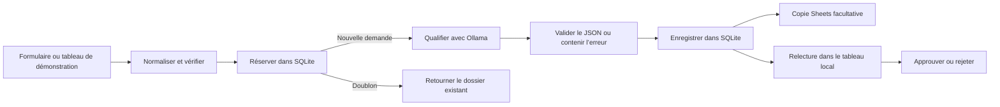

# L’Atelier n8n — qualification IA des demandes

Un atelier local pour montrer comment une demande de contact devient un brouillon contrôlé et relu par une personne. **n8n orchestre le traitement, Ollama exécute le modèle sur le Mac, SQLite conserve les dossiers et Google Sheets peut recevoir une copie de suivi.**

Aucun email n’est envoyé. Le projet est un prototype de démonstration avec des données fictives. Le workflow historique et l’exemple d’initiation sont conservés ; la qualification IA utilise un workflow distinct.

## Ce que fait le workflow



Le modèle propose une catégorie, un résumé, les informations manquantes et un brouillon. Il reçoit le texte de la demande, sans les champs nom et email ; une donnée personnelle déjà écrite dans ce texte lui reste transmise.

C’est un **workflow déterministe utilisant un LLM**. Le modèle n’a aucun outil et ne choisit pas les actions à exécuter. Les contrôles, la persistance et les décisions humaines appartiennent à l’application.

## Démarrer la démonstration

Prérequis : macOS, Docker Desktop et Ollama installés. La démonstration normale utilise `qwen2.5:3b` en local. Les commandes de génération et de tests sur le Mac demandent Node.js 22.13 ou plus récent ; le service API s’exécute dans Docker.

1. Ouvrir **Start-Demo.command**, ou lancer `bash scripts/start-demo.sh` depuis ce dossier. Le script démarre les dépendances, vérifie le modèle et le télécharge s’il manque.
2. Ouvrir [n8n](http://localhost:5678). À la première installation, créer le propriétaire local ; aucun abonnement n8n Cloud n’est nécessaire. Sur une instance existante, conserver son compte et ses données.
3. Pour une première installation sans Google Sheets, lancer :

```bash
node scripts/build-workflows.mjs
bash scripts/install-demo.sh --public
```

4. Ouvrir le [tableau de démonstration](http://localhost:8787), choisir **Demande complète**, puis **Lancer la qualification**.
5. Examiner le résultat et le journal, puis ouvrir l’exécution correspondante dans n8n pour expliquer les nœuds.

Le démarrage quotidien **ne réimporte pas** le workflow. L’installation est une action explicite : elle importe, publie et redémarre n8n. Pour une installation manuelle, importer `workflows/02-qualification-ia.json` avec **Import from File**, enregistrer et publier/activer. Le workflow s’appelle **L’Atelier n8n · Qualification IA des demandes**.

La version publique fonctionne sans Google Sheets : sa branche est désactivée et le résultat reste dans SQLite et le tableau. Le [formulaire n8n](http://localhost:5678/form/atelier-qualification-form) fournit une seconde entrée après publication ; son accusé de réception ne confirme pas encore la réussite de l’analyse.

Pour démarrer uniquement les services Docker :

```bash
docker compose -f compose.yaml -f compose.demo.yaml up -d --wait
```

Pour l’initiation d’origine, utiliser `Start.command` et [Your first workflow](FIRST-WORKFLOW.md), conservé en anglais. `Start.command` et `Stop.command` pilotent n8n seul ; `Start-Demo.command` et Compose avec les deux fichiers prennent aussi en charge la qualification.

## Connecter Google Sheets

Créer un tableur de démonstration avec l’onglet **Qualification IA** et ces **13 en-têtes** sur sa première ligne :

```text
demande_id	date	prenom	nom	email	demande	categorie	resume	informations_manquantes	brouillon_reponse	statut	erreur	modele
```

| Colonne | Contenu |
| --- | --- |
| `demande_id` | Clé utilisée pour ajouter ou mettre à jour la ligne |
| `date` | Création de la demande |
| `prenom`, `nom`, `email` | Champs de contact |
| `demande` | Message original |
| `categorie`, `resume` | Qualification proposée |
| `informations_manquantes` | Précisions à obtenir, séparées par une barre verticale |
| `brouillon_reponse` | Proposition à relire |
| `statut` | État lors de la copie initiale |
| `erreur` | Code d’erreur technique éventuel |
| `modele` | Modèle utilisé, si disponible |

Configurer une connexion **Google Sheets OAuth2** dans n8n avec accès au tableur. Générer et installer la copie privée :

```bash
SHEETS_DOCUMENT_ID='ID_DU_TABLEUR' \
SHEETS_CREDENTIAL_ID='ID_DE_LA_CONNEXION_N8N' \
SHEETS_TAB_NAME='Qualification IA' \
node scripts/build-workflows.mjs --local

bash scripts/install-demo.sh --workflow local-files/02-qualification-ia.json
```

Les valeurs sont des références de configuration, pas des mots de passe ou jetons. Les secrets OAuth restent dans n8n. `SHEETS_DOCUMENT_ID` et `SHEETS_CREDENTIAL_ID` sont requis ensemble ; le nom d’onglet est facultatif. La génération ne crée pas le document ni sa connexion.

La copie `local-files/02-qualification-ia.json` est ignorée par Git. Ne pas la publier. Pour importer manuellement, choisir ce fichier et ne conserver qu’une version active sur le chemin `atelier-qualification`.

Le nœud effectue `appendOrUpdate` par `demande_id` en mode **RAW**, pour conserver les chaînes sans les interpréter comme des formules.

**SQLite fait autorité. Sheets reçoit une projection du résultat avant la décision humaine.** Approuver ou rejeter ensuite modifie SQLite et le tableau local, sans mettre à jour la ligne Sheets. Renvoyer une demande déjà terminée ne relance pas non plus sa synchronisation.

## Scénarios à présenter

| Scénario | Comportement à observer |
| --- | --- |
| Demande complète | Appel réel à Ollama, analyse structurée, brouillon à relire |
| Informations manquantes | Appel réel, précisions affichées, état `needs_info` si le modèle les identifie |
| Même identifiant et même contenu | Dossier existant, sans nouvel appel au modèle |
| Même identifiant et contenu différent | Conflit ; ancien dossier conservé |
| Panne API simulée | Trois tentatives HTTP maximum puis `technical_error` |
| JSON invalide simulé | Rejet du résultat et erreur conservée |
| Instruction malveillante | Appel réel, aucun outil d’action disponible ; contenu à contrôler humainement |
| Approbation ou rejet | Décision dans le journal, aucun email envoyé |

Les pannes injectées sont explicitement simulées. Un JSON conforme n’atteste pas l’exactitude du texte : classification et brouillon doivent être relus. **Nouvel identifiant** crée un nouveau test ; pour montrer un doublon, renvoyer les mêmes champs et le même scénario.

## Fichiers et guides

| Fichier ou dossier | Rôle |
| --- | --- |
| `compose.yaml` | n8n, stockage persistant et disponibilité |
| `compose.demo.yaml` | API de qualification, tableau et volume SQLite |
| `Start-Demo.command`, `scripts/start-demo.sh` | Démarrage de la démonstration |
| `scripts/install-demo.sh` | Installation ou mise à jour explicite du workflow |
| `workflows/01-hello.json` | Exemple d’initiation sans service externe |
| `workflows/02-qualification-ia.json` | Export public sans référence privée |
| `scripts/build-workflows.mjs` | Générateur du workflow |
| `demo/server.mjs` | Réservation, contrat IA, Ollama, stockage et décisions |
| `demo/public/index.html` | Soumission, revue et journal |
| `demo/test/`, `scripts/test-workflow.mjs` | Tests du service et scénarios d’intégration |
| [Conception](docs/CONCEPTION.md) | Besoin, choix et critères de réussite |
| [Exploitation](docs/EXPLOITATION.md) | Configuration, reprises, sauvegarde et limites |
| [Entretien](docs/ENTRETIEN.md) | Démonstration de 15 minutes et questions techniques |

## Vérifier

```bash
# Générer le fichier public sans les références Sheets locales.
npm run workflows:build

# Tests isolés du service.
npm test

# Afficher les cas d’intégration sans appel réseau.
node scripts/test-workflow.mjs --dry-run

# Essais réels : crée des demandes fictives dans l’instance locale.
node scripts/test-workflow.mjs

# Exiger également une confirmation de synchronisation Sheets.
WORKFLOW_TEST_REQUIRE_SHEETS=1 node scripts/test-workflow.mjs

git diff --check
```

Les tests du service couvrent notamment les doublons concurrents, le bail, le JSON, la décision humaine et les erreurs, avec des appels au modèle simulés. Ils ne prouvent pas une exécution complète dans n8n, Ollama et Sheets. Les commandes d’intégration ci-dessus sont un mode d’emploi ; elles ne constituent pas une affirmation de réussite sur une installation particulière.

## Données, arrêt et mises à jour

GitHub conserve les sources, guides et exports publics. Il ne sauvegarde pas le compte n8n, les connexions, la clé de chiffrement ou les demandes. Les volumes persistants sont `n8n-desktop_n8n_data` et `n8n-desktop_qualification_data`. Avant de publier un export, vérifier données épinglées, secrets, références privées et informations client.

Pour arrêter sans supprimer les données :

```bash
docker compose -f compose.yaml -f compose.demo.yaml stop
```

**Ne pas utiliser `docker compose down -v`** : `-v` supprime les volumes. Une réinitialisation de Docker Desktop peut aussi les effacer. Les [procédures de sauvegarde et restauration](docs/EXPLOITATION.md#sauvegarder-et-restaurer) incluent les deux volumes et la clé n8n.

Pour changer le port n8n, copier `.env.example` dans `.env`, modifier `N8N_PORT`, puis relancer. L’image n8n est fixée par digest SHA-256 ; `docker compose pull` seul ne la met pas à niveau. Sauvegarder avant toute migration et suivre les notes de publication. Le retour à une ancienne version peut nécessiter une restauration.

Les ports publiés sont liés à `127.0.0.1`. Le Mac doit rester allumé et éveillé, avec Docker et Ollama actifs. Le prototype n’offre ni authentification métier multi-utilisateur ni haute disponibilité. Pour les erreurs de connexion, modèle ou OAuth, consulter [Diagnostic](docs/EXPLOITATION.md#diagnostic).

## Références

- [Documentation officielle n8n](https://docs.n8n.io/)
- [Installation Docker Compose](https://github.com/n8n-io/n8n-docs/blob/main/docs/deploy/host-n8n/install-options/install-using-docker-compose.md)
- [Versions et notes de publication n8n](https://github.com/n8n-io/n8n/releases)
- [Documentation officielle Ollama](https://docs.ollama.com/)

Le dépôt utilise l’image officielle n8n, qui reste soumise à la licence de son éditeur.
