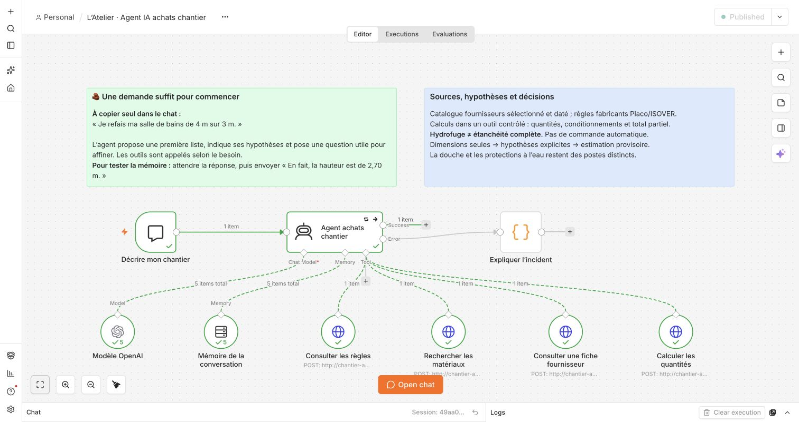
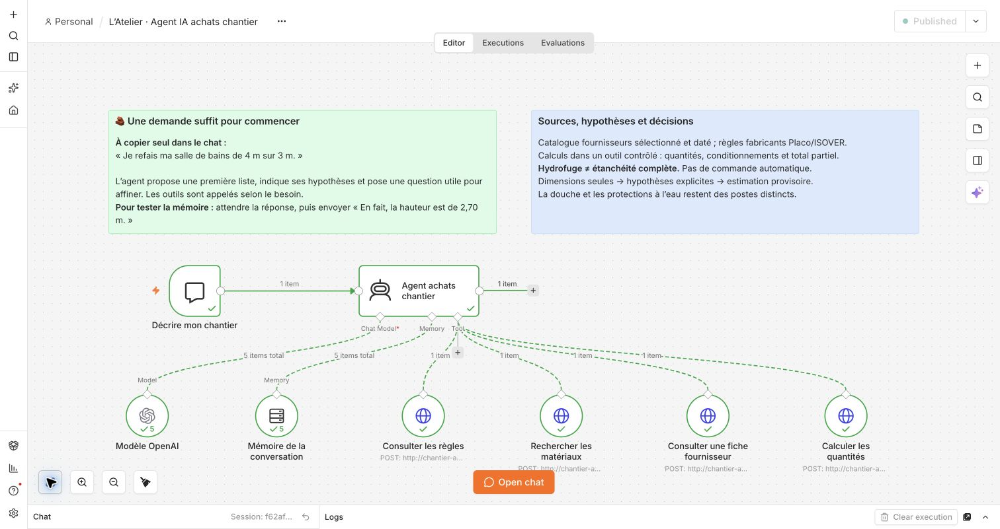
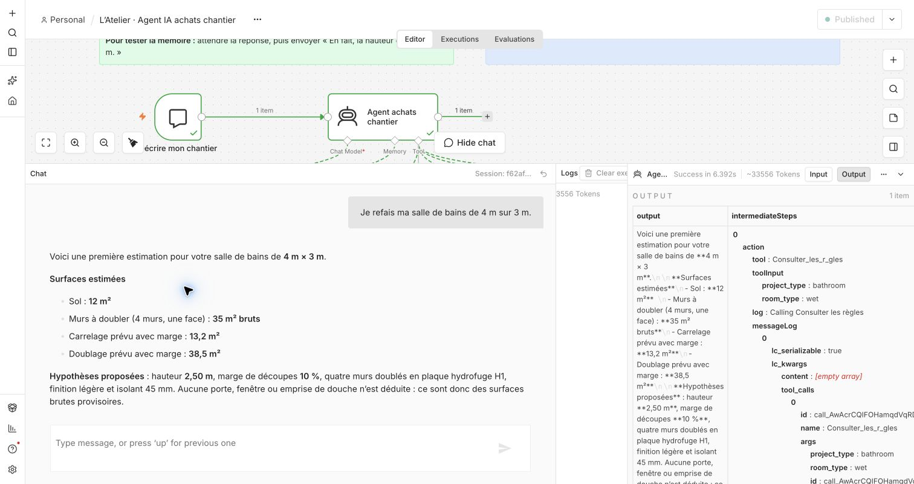
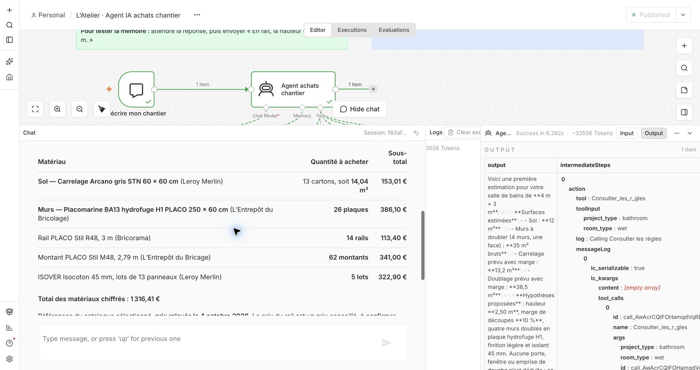

# Démonstration : une salle de bains à partir de deux dimensions

## Le message à saisir

Ouvrir [le workflow dans n8n](http://localhost:5678/workflow/atelierAgentChantier01), cliquer sur **Open chat**, puis sur **Reset** pour commencer une nouvelle conversation. Envoyer seulement :

> Je refais ma salle de bains de 4 m sur 3 m.

Le parcours de cette version propose une première estimation avant de demander des précisions. Il utilise les deux dimensions données, puis annonce les hypothèses nécessaires. L'utilisateur peut ensuite corriger une hauteur, retirer un poste ou préciser une ouverture en langage naturel.

Il ne faut pas recopier des noms de produits, des paramètres d'ossature ou un objet JSON. Ces éléments appartiennent aux outils et aux règles du projet.

## Ce que signifie le premier résultat

Le calculateur connaît la longueur et la largeur parce que l'utilisateur vient de les donner. Il distingue ces informations des choix provisoires : hauteur de 2,50 m, pièce rectangulaire, rénovation du sol et des quatre murs, ouvertures non déduites et marge de 10 %. Les détails du système et les postes manquants restent à vérifier avant achat.

| Mesure | Calcul | Résultat |
| --- | --- | ---: |
| Surface brute du sol | 4 × 3 | 12 m² |
| Périmètre des murs | 2 × (4 + 3) | 14 m |
| Surface brute des murs | 14 × 2,50 | 35 m² |
| Surface de sol avec marge | 12 × 1,10 | 13,20 m² |

Ces mesures ne sont pas un plan de pose. Les arrondis aux cartons, plaques, rails ou lots entiers sont effectués ensuite, avec les conditionnements du catalogue. Une marge de 10 % peut donc conduire à acheter un surplus réel supérieur à 10 %.

Les plaques H1 sont retenues pour le scénario de salle de bains. Une plaque hydrofuge ne constitue pas à elle seule une protection complète à l'eau. Les zones de douche, pieds de parois, joints et traversées restent des points distincts à traiter.

**Le montant est un budget partiel de matériaux sélectionnés**, pas le coût de rénovation de la salle de bains. Les prix proviennent du relevé daté du catalogue ; le stock et le prix en caisse ne sont pas vérifiés. Sanitaires, plomberie, électricité, dépose, main-d'œuvre et certains consommables ou systèmes de protection ne font pas partie de ce montant.

### Résultat observé dans n8n

Le 4 octobre 2026, l'exécution **86** a retourné la liste suivante à partir du seul premier message. Le résultat utilise le catalogue sélectionné et les hypothèses ci-dessus.

| Matériau | Quantité achetée | Sous-total |
| --- | ---: | ---: |
| Carrelage Arcano gris 60 × 60 cm | 13 cartons, soit 14,04 m² | 153,01 € |
| Placomarine BA13 H1 250 × 60 cm | 26 plaques | 386,10 € |
| Rail PLACO Stil R48 de 3 m | 14 rails | 113,40 € |
| Montant PLACO Stil M48 de 2,79 m | 62 montants | 341,00 € |
| ISOVER Isocoton 45 mm | 5 lots de 13 panneaux, soit 46,80 m² | 322,90 € |
| **Total des matériaux chiffrés** | | **1 316,41 €** |

Le rail utilise un **prix conseillé**, à confirmer au point de vente. Les références viennent de plusieurs enseignes : Leroy Merlin, L'Entrepôt du Bricolage et Bricorama. La réponse de l'exécution **86** affichait un lien réel par référence. L'essai manuel **89** a affiché les noms et enseignes sans hyperliens, malgré la consigne du prompt. Les URL restent disponibles dans les sorties des outils et dans le [catalogue documenté](../catalog.json) ; leur présence dans chaque réponse naturelle n'est donc pas garantie. Ce montant n'inclut pas les postes exclus et ne constitue pas un prix ferme d'achat.

## Les deux phrases à dire pendant l'entretien

> « L'utilisateur me donne seulement le type de pièce et ses dimensions. L'agent prépare une première estimation en rendant visibles les hypothèses qu'il a ajoutées. »

> « Le modèle choisit les outils et explique le résultat. Les surfaces, conditionnements et prix sont calculés dans du code contrôlé, puis l'utilisateur peut corriger une hypothèse sans tout recommencer. »

## Montrer la mémoire et la mise à jour

Attendre la réponse complète avant d'envoyer un message suivant, dans la même conversation. Pour préciser l'aménagement :

> Il y aura une douche avec un receveur. Garde les dimensions.

Lors de l'exécution **87**, l'agent a conservé la première estimation et demandé les dimensions du receveur. Le calcul conserve les **12 m² de sol brut**, car aucune emprise de receveur n'a été mesurée. La douche ne bloque donc plus la proposition de matériaux de base. Le receveur et son système de protection à l'eau restent des postes non chiffrés.

Pour montrer une modification mesurable et une limite prise en charge :

> En fait, la hauteur sous plafond est de 2,70 m.

La surface du sol reste de **12 m²** et le périmètre de **14 m**. La surface brute des murs devient **37,80 m²**. Le système de doublage retenu pour cette première sélection ne couvre pas ce nouveau cas : l'agent doit le signaler, conserver le chiffrage du sol et ne pas réutiliser un calcul de murs à 2,50 m pour une hauteur de 2,70 m.

Cette suite montre une limite prise en charge : l'agent ne doit ni perdre les dimensions précédentes, ni bloquer tous les postes parce qu'un seul sort du périmètre disponible. Pour une démonstration centrée sur la première estimation, le premier message suffit.

## Les huit nœuds du parcours normal et la branche d’incident

| Nœud | Ce qu'il fait dans ce scénario |
| --- | --- |
| **Décrire mon chantier** | Reçoit la phrase et son identifiant de conversation. |
| **Agent achats chantier** | Reconnaît une salle de bains, choisit les outils, prépare leur entrée et compose la réponse. |
| **Modèle OpenAI** | Fournit la compréhension du langage et les décisions de l'agent. |
| **Mémoire de la conversation** | Conserve 4 m et 3 m lorsque l'utilisateur précise seulement la nouvelle hauteur. |
| **Consulter les règles** | Retourne le périmètre salle de bains, les hypothèses autorisées et les limites à restituer. |
| **Rechercher les matériaux** | Retrouve des références dans la sélection sourcée ; ce n'est pas une recherche dans tout le site Leroy Merlin. |
| **Consulter une fiche fournisseur** | Lit les données d'une référence choisie, notamment le conditionnement et le caractère H1 de la plaque. La démo utilise les données datées. |
| **Calculer les quantités** | Calcule les mesures, les quantités arrondies et les sous-totaux ; distingue les postes calculables des postes à revoir. |

Les quatre outils sont reliés à l'agent comme des capacités disponibles. Ce ne sont pas quatre étapes que le workflow exécute systématiquement de gauche à droite. Pour montrer le raisonnement observable, ouvrir les journaux de l'exécution et lire les paramètres et résultats des appels réellement effectués.

Un **neuvième nœud, Expliquer l’incident**, complète maintenant ce parcours. Il est relié uniquement à la sortie d'erreur de l'agent et reste donc inactif lors d'une estimation réussie. Il affiche une réponse compréhensible sans modèle, sans prix inventé et avec une référence d'incident. Voir [l’exploitation et les essais de panne](EXPLOITATION.md).

## Le code à expliquer simplement

Le message de l'utilisateur ne devient pas directement un prix. L'agent extrait le besoin et appelle le calculateur avec des paramètres, par exemple :

```json
{
  "project_type": "bathroom",
  "length_m": 4,
  "width_m": 3
}
```

Le service complète uniquement les hypothèses prévues par sa règle, en gardant leur origine. Une valeur `provided` vient des paramètres transmis ; une valeur `default` est une hypothèse du programme ; une valeur `derived` est calculée à partir d'autres valeurs. Les hypothèses restent présentées à l'utilisateur pour qu'il puisse les corriger. Comme le modèle transmet les paramètres, la relecture de leur sens reste nécessaire : une valeur techniquement valide peut encore résulter d'une mauvaise interprétation du message.

Le calcul déterministe sépare le lot sol du lot murs. Cela permet de renvoyer un résultat partiel lorsqu'une hauteur ou un système ne peut pas être couvert. Un poste sans chiffrage ne vaut pas zéro : il reste inconnu et le résultat indique seulement le sous-total connu.

Pour les murs, le scénario chiffre un **doublage à une face**, et non une cloison à deux faces. Le gabarit fabricant retenu utilise des montants doublés : deux profils métalliques par station prévue. Ce doublement des profils ne double ni les plaques visibles ni la surface de l'isolant. L'agent présente une provision d'approvisionnement, pas un plan d'ossature détaillé.

La mémoire sert à comprendre la modification. Elle ne suffit pas à mettre à jour un total : **une nouvelle dimension exige un nouvel appel au calculateur**.

## Vérifier le scénario avant la démonstration

```sh
# Présente les messages prévus, sans appel au modèle.
node chantier/test-agent-room.mjs --dry-run

# Lance les conversations de test réelles sur l'instance locale.
node chantier/test-agent-room.mjs --run
```

Le test réel vérifie les appels enregistrés dans n8n, les mesures retournées, les hypothèses, les prix des conditionnements et le comportement après changement de hauteur. Les réponses naturelles doivent aussi être relues. Une campagne réussie prouve les comportements observés ; elle ne garantit pas chaque formulation future, la disponibilité du fournisseur ou la conformité d'un ouvrage.

### Validation réelle du 4 octobre 2026

| Exécution | Message | Outils observés | Résultat vérifié | Temps côté test |
| --- | --- | --- | --- | ---: |
| 86 | Salle de bains de 4 m sur 3 m | Règles, recherche, fiche H1, calculateur | Estimation de 1 316,41 €, hauteur et marge toujours identifiées comme hypothèses | 15,504 s |
| 87 | Ajout d'une douche avec receveur | Règles, calculateur | Même liste provisoire ; contexte receveur transmis, aucune emprise inventée | 10,022 s |
| 88 | Hauteur corrigée à 2,70 m | Règles, calculateur | Murs : 37,80 m² non chiffrés ; sol conservé à 153,01 € ; total complet inconnu | 12,167 s |

**Les trois tours de cette campagne ont réussi**, dans la même session. Les assertions lisent les résultats des outils enregistrés dans n8n ; elles ne se contentent pas de chercher un montant dans le texte. Les trois réponses ont également été relues. Les traces complètes restent dans le dossier local ignoré `work/chantier-validation/check-chantier-room-20261004145015397-e10256/`.

Une tentative précédente, l'exécution **85**, avait échoué avec `Request timed out` lors du quatrième appel au modèle, après des appels réussis aux règles, à la recherche et à la fiche. Le test s'est arrêté à cet échec ; la campagne ci-dessus a ensuite été lancée dans une nouvelle session. Cet incident montre que la connexion au modèle reste une dépendance de la démonstration. Il ne faut pas présenter la campagne suivante comme une garantie d'absence de panne.

L'appel modèle en échec a duré environ **10,5 secondes**, alors que le délai du nœud modèle est configuré à **60 secondes**. Le diagnostic suggère un délai de connexion de **10 secondes**, plus court que le délai de réponse du modèle. C'est une cause probable, mais **la cause exacte de l'exécution 85 n'a pas été prouvée**. Les trois outils locaux avaient terminé en quelques dizaines de millisecondes ; leur délai ne suffit donc pas à expliquer cet incident.

Une formulation de la réponse **88** reste ambiguë : « Sol brut hors emprise non mesurée du receveur ». La donnée vérifiée du calculateur est bien **12 m² bruts, avant toute déduction du receveur** ; la quantité de 13 cartons ne déduit aucune emprise inconnue. C'est cette formulation précise qu'il faut utiliser à l'oral.

### Vérification manuelle dans l'éditeur n8n

**Vérification finale de la version publiée à neuf nœuds :** le 4 octobre à 17 h 20, le même message court a réussi dans l’éditeur en **17,101 secondes**. Les quatre outils ont été appelés ; la réponse affiche les cinq liens fournisseurs, les hypothèses, les exclusions et le total partiel de **1 316,41 €**. Cette version utilise deux tentatives au niveau de l’Agent et aucune reprise implicite côté modèle. Le nœud d’incident reste gris : c’est normal, puisqu’aucune panne n’a été rencontrée sur cet essai.



Les captures suivantes conservent la vérification précédente du parcours normal, avant l’ajout de la branche d’incident.

Le même premier message a ensuite été saisi directement dans le chat de l'éditeur. L'exécution **89** a réussi en **15,011 secondes** selon n8n. Les **quatre outils ont été appelés** et les **huit nœuds apparaissent en vert**. La réponse retrouve **1 316,41 €**, avec les mêmes quantités : 13 cartons, 26 plaques H1, 14 rails, 62 montants et 5 lots d'isolant.

Cette vérification porte sur le vrai workflow et sa conversation native, en complément du test par requête HTTP. L'absence d'hyperliens dans cette réponse manuelle est décrite plus haut ; les quantités et sous-totaux correspondent aux sorties du calculateur.






