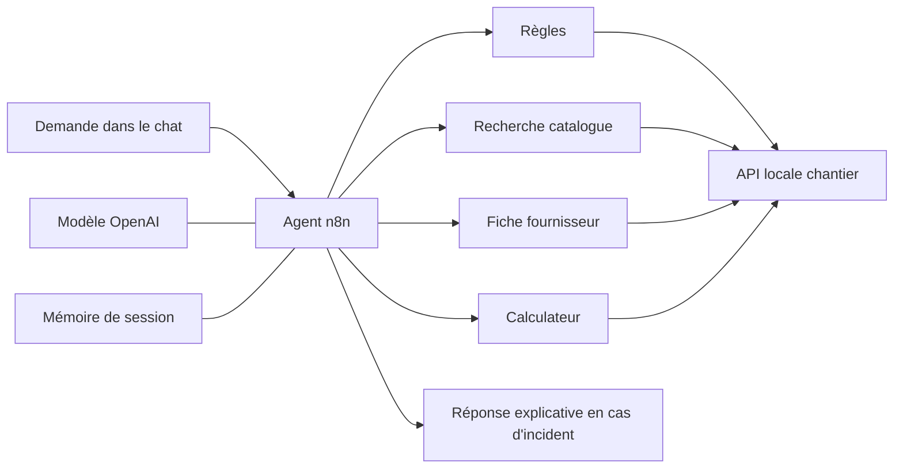

# Exploitation et incidents — Agent achats chantier

Audit du code et des preuves disponibles le **4 octobre 2026**. Cette page prépare les sujets architecture, API, LLM, sécurité, erreurs et mise en production de l’entretien. Elle distingue un mécanisme écrit, un test exécuté et une évolution encore nécessaire.

Le projet actuel est une **démonstration locale d’aide à l’achat**. Il propose des quantités et un budget partiel à partir de données sourcées. Il ne commande rien et ne constitue pas un service public prêt à recevoir des données clients.

## Architecture à expliquer

Le chat déclenche le nœud **Agent achats chantier**. Le modèle choisit ses appels parmi quatre outils HTTP. Chaque résultat revient à l’agent, qui décide de continuer, de demander une précision ou de répondre. La mémoire garde le contexte de la session. Les outils ne sont donc pas quatre étapes obligatoires à chaque message.



La dernière branche est décrite plus bas avec son état de validation. Les règles, le catalogue et les calculs restent dans le service `chantier-api`. Le modèle organise la conversation ; le code calcule les surfaces, conditionnements et euros. Un changement de fournisseur de modèle ne nécessite donc pas de réécrire les formules métier.

| Élément | Rôle et choix observés dans le code | Limite actuelle |
| --- | --- | --- |
| Chat n8n | Entrée textuelle ; téléversement de fichiers désactivé. | Chat sans authentification propre, réservé au poste local. |
| AI Agent | Choix des outils ; maximum **8 itérations** ; étapes intermédiaires conservées. | Le comportement conversationnel reste probabiliste. |
| OpenAI | Appel natif depuis n8n ; modèle configuré `gpt-5.6-terra`, Responses API, effort `low`. | Dépend de la connexion, du compte, du quota et de la disponibilité du fournisseur. |
| Mémoire | Fenêtre de **8** éléments de contexte configurée, indexée par `sessionId`. | Mémoire simple ; ne pas revendiquer une persistance après redémarrage ni une isolation multi-client. |
| API Node | Quatre outils indépendants du modèle, catalogue et règles chargés au démarrage ; création locale du PDF à l’issue d’un calcul exploitable. | Un processus local ; reconstruire et recréer le service après modification du code ou du catalogue embarqué. |
| Calculateur | Fonctions déterministes, contrôles des entrées et prix en centimes. | Catalogue et configurations bornés ; aucun dimensionnement complet d’un ouvrage. |
| n8n/Docker | Exécutions sauvegardées et services avec contrôle de disponibilité. | Aucun cluster ni haute disponibilité. |

Sources du projet : [générateur n8n](../build-workflow.mjs), [consignes de l’agent](../agent-prompt.txt), [API](../server.mjs), [calculateur](../quantities.mjs), [configuration Docker](../../compose.chantier.yaml).

## Contrat des API

Les outils n8n appellent `http://chantier-api:3000` dans le réseau Docker. Le port de diagnostic est publié sur `127.0.0.1:8788`. Les corps des outils sont des objets JSON.

| Route | Entrée principale | Sortie et responsabilité |
| --- | --- | --- |
| `GET /health` | Aucune. | État du processus, nombre de produits, date du catalogue. Aucun appel au modèle. |
| `POST /tools/rules` | `project_type`, `room_type`. | Règles, hypothèses autorisées, périmètre, sources et informations nécessaires. |
| `POST /tools/search` | `query`, catégorie facultative. | Recherche lexicale dans le catalogue sélectionné, au maximum dix résultats. |
| `POST /tools/product` | `product_id`, `refresh` facultatif. | Fiche datée ; tentative de consultation en ligne uniquement si demandée. |
| `POST /tools/estimate` | Contrat du projet, par exemple `bathroom`, `length_m`, `width_m`. | Mesures, hypothèses, lots à acheter, montants, exclusions et état métier ; champ `report` avec le lien du PDF si la création aboutit. |
| `GET /reports/<32 caractères hexadécimaux>.pdf` | Identifiant généré par le serveur. | Téléchargement du PDF enregistré, ou erreur 404. Aucun accès aux instantanés JSON. |

Un statut HTTP 200 ne signifie pas nécessairement qu’un devis est disponible. Les outils métier peuvent retourner `needs_information`, `unsupported`, `invalid_input` ou `partial`. L’agent doit lire cet état. Par exemple, une hauteur de **2,70 m** conserve le chiffrage du sol, mais ne produit pas un faux total pour les murs.

Les erreurs de transport/format sont distinctes : JSON invalide **400**, corps trop volumineux **413**, type de contenu incorrect **415**, certains champs refusés **422**, référence inconnue **404**. Une exception interne inattendue devient une réponse **500** générique, sans pile d’appels ni détail brut.

## Ce qui empêche un chiffrage inventé

Pour la salle de bains de 4 × 3 m, le moteur déduit 12 m² de sol et 14 m de périmètre. Si la hauteur est absente, il annonce **2,50 m comme hypothèse**, ce qui donne 35 m² de murs bruts. Il ne prétend pas que la pièce n’a pas de porte : aucune ouverture n’est déduite avant d’avoir ses mesures.

Le doublage comporte une face visible par mur, des montants doublés et une seule cavité d’isolant. Les conditionnements sont arrondis au supérieur : le lot Isocoton contient treize panneaux, pas un seul. Une information confirmée remplace le défaut lors du calcul suivant. Un prix absent reste inconnu.

Le panier conserve le lien et la date de chaque prix. Le rail comporte en plus la mention **prix conseillé**. La consultation d’un éventuel prix récent ne remplace pas silencieusement les valeurs du catalogue utilisées par le calculateur. Une plaque H1 ne valide pas l’étanchéité de la douche ; les postes non calculés restent visibles.

## Trois familles d’incidents

| Situation | Traitement présent | Ce que l’on dit à l’utilisateur |
| --- | --- | --- |
| Donnée impossible, dimensions manquantes, finition hors périmètre | Validation déterministe et résultat métier explicite. | Corriger la donnée ou présenter seulement les postes calculés. |
| Fiche fournisseur bloquée, trop longue, lente ou ambiguë | Repli vers le relevé daté, avec motif dans `refresh.status`. | « La vérification en ligne n’a pas abouti ; voici le prix relevé à telle date. » |
| Modèle, quota ou outil indisponible | Délais bornés ; nouvelle branche explicative décrite ci-dessous. | Aucun prix inventé, référence d’incident et action adaptée. |

### Délais et reprises

- Consultation d’une fiche fournisseur : **8 secondes** au maximum et **2 Mio** de réponse ; redirections refusées.
- Outil HTTP appelé depuis n8n : **15 secondes** configurées.
- Requête au modèle : **60 secondes** configurées, avec `maxRetries: 0` dans le nœud modèle. Les reprises implicites du client sont désactivées pour conserver une seule politique de reprise.
- Nœud Agent : `retryOnFail: true`, **2 tentatives au total**, avec **1 seconde** entre les tentatives (`maxTries: 2`, `waitBetweenTries: 1000`). La deuxième tentative relance le nœud Agent ; il ne s’agit pas d’un plafond de deux appels au modèle pour toute la conversation, car chaque tentative peut effectuer plusieurs itérations.
- Exécution du workflow : **300 secondes** configurées au maximum.

Ces bornes limitent l’attente ; elles ne garantissent pas qu’une réponse de secours sera envoyée si n8n s’arrête ou si l’exécution entière est interrompue. Une reprise peut répéter des appels au modèle et aux outils. Les outils ne passent aucune commande ; ce choix évite de répéter un achat. L’outil de calcul écrit désormais un rapport local : une reprise peut donc créer un nouvel instantané PDF et consommer du stockage, ainsi que des appels supplémentaires au fournisseur de modèle. Le projet n’a pas de file de reprise durable ni de mécanisme de circuit ouvert.

La reprise n8n est **non sélective** : une erreur d’authentification ou de quota reçoit elle aussi une deuxième tentative. Le champ final `retryable: false` conseille ensuite de corriger la configuration ; il ne supprime pas cette reprise automatique. Une politique sélective, avec délai progressif adapté au fournisseur, reste une amélioration de production.

### Branche « Expliquer l’incident » : état précis

Le générateur contient maintenant `onError: continueErrorOutput` sur l’agent et un neuvième nœud Code, **Expliquer l’incident**. [Son code](../incident-response.js) construit une réponse sans nouvel appel au modèle. Il distingue authentification, quota, limitation de débit, délai dépassé, réponse invalide et indisponibilité générique.

Il retourne `status: technical_error`, un code, un indicateur `retryable` et une référence fondée sur l’identifiant d’exécution. Il ne réaffiche pas le texte brut de l’erreur, une clé, une pile d’appels ou un montant obtenu pendant une tentative incomplète. Les incidents d’authentification ou de quota invitent à vérifier la configuration plutôt qu’à répéter aveuglément la demande.

**Version installée et publiée le 04/10/2026 à 17 h 16, heure de Paris :** neuf nœuds, avec deux tentatives Agent et aucune reprise du client modèle. Dans une instance n8n jetable, cinq erreurs simulées ont atteint la branche attendue : authentification 401, quota 429, service 503, JSON invalide et délai dépassé. Deux autres scénarios, 503 puis succès et 429 temporaire puis succès, ont récupéré à la deuxième tentative sans emprunter la branche d’incident. Un huitième essai a ensuite vérifié le message d’incident après un appel d’outil réussi suivi d’un 503 persistant. **Huit contrôles sur huit sont réussis**, sans véritable appel OpenAI. Le protocole et ses limites sont détaillés dans [INCIDENTS-VALIDATION.md](INCIDENTS-VALIDATION.md).

Lorsqu’une erreur est traitée par une branche, l’exécution peut se terminer techniquement sans échec global. Pour une surveillance future, il faudra suivre aussi `technical_error` et son code, pas seulement la couleur de l’exécution n8n.

## Démontrer les erreurs sans casser la démo

1. **Erreur métier, directement dans le chat.** Après la demande 4 × 3 m, envoyer « En fait, la hauteur est de 2,70 m. » Montrer la hauteur conservée, le sol encore chiffré et les murs à redimensionner. C’est une adaptation du périmètre, pas une panne du modèle.
2. **Erreur fournisseur, dans les tests isolés.** Montrer les tests qui simulent HTTP 429/500, réponse invalide ou délai dépassé. Le résultat conserve le prix daté et indique pourquoi il n’a pas été actualisé. Ces tests injectent une réponse réseau contrôlée ; ils ne dépendent pas d’une panne du site marchand.
3. **Erreur technique n8n, dans une instance jetable.** Le script `test-agent-incidents.mjs` copie les nœuds réels vers une base distincte et les relie à un faux fournisseur local, sur un réseau interne. Cinq cas d’erreur ont vérifié la branche explicative, son code et l’absence de prix final ; deux erreurs transitoires ont vérifié une récupération à la deuxième tentative. Un dernier cas couvre une panne après un appel d’outil réussi. Ne pas remplacer la vraie clé OpenAI, ne pas supprimer la connexion et ne pas arrêter le service partagé pendant la présentation principale. Montrer plutôt [le rapport des essais](INCIDENTS-VALIDATION.md).

Commande disponible pour rejouer les contrôles de code depuis la racine du dépôt :

```sh
node --test chantier/test/*.test.mjs
```

Les réponses HTTP simulées prouvent le traitement par le code ; elles ne prouvent pas la disponibilité d’un fournisseur au moment de l’entretien. Ne pas présenter un changement de prompt comme la réparation d’un problème de connexion.

## Preuves vérifiées

| Vérification | État réellement observé |
| --- | --- |
| Tests de code | **48 tests exécutés et réussis** lors de cet audit du 04/10/2026 : calculs, API, contrôles de sources, incidents fournisseur simulés et mise en forme de la réponse d’incident. |
| Première estimation salle de bains | Trace n8n **86** : quatre outils appelés, total **1 316,41 €** pour le panier principal, hypothèses conservées comme telles. |
| Vérification finale dans l’éditeur | Le 04/10 à **17 h 20**, sur la version publiée avec Agent deux tentatives et modèle sans reprise : **17,101 s**, quatre outils, cinq liens fournisseurs et **1 316,41 €**, avec hypothèses et exclusions. [Capture du workflow](images/salle-de-bains/04-workflow-avec-incidents.png). |
| Ajout d’un receveur | Trace **87** : le besoin reste une salle de bains ; quantités provisionnelles conservées, sans validation du receveur. |
| Modification de hauteur | Trace **88** : hauteur 2,70 m, résultat partiel, sous-total connu du sol **153,01 €**, total global absent. |
| Installation de la branche d’incident et des reprises | Workflow à neuf nœuds installé et publié avec Agent limité à deux tentatives et client modèle sans reprise le 04/10/2026 à **17 h 16**, heure de Paris. |
| Pannes contrôlées dirigées vers la branche dans n8n | Cinq cas réussis dans une **instance jetable** : 401, quota 429, 503, JSON invalide et délai dépassé. Identifiants 1 à 5 de cette seule base de test. |
| Récupération après erreur transitoire | **Deux essais réussis** : 503 puis succès et 429 temporaire puis succès. Deux requêtes émises et récupération au deuxième essai, sans réponse d’incident. |
| Panne au cours de la boucle après un outil | Appel d’un outil HTTP synthétique réussi une fois, puis 503 persistant : `SERVICE_UNAVAILABLE` et réponse contrôlée. Trois requêtes au faux modèle et deux tentatives Agent. |
| Fournisseur en direct, stock et achat | Aucune garantie déduite des essais ; aucun achat effectué. |

Le rapport vérifié de cette configuration est `work/chantier-incidents/chantier-incidents-20261004151545732-476c6b/summary.json` : sept tests réussis sur sept, `passed: true`, zéro appel réel au modèle et nettoyage terminé sans ressource restante. Les identifiants d’exécution 1 à 7 appartiennent à sa base jetable, pas à l’instance de démonstration. Le [rapport public de validation](INCIDENTS-VALIDATION.md) décrit la configuration et les écarts contrôlés du banc d’essai.

Le cas après outil est confirmé par `work/chantier-incidents/chantier-incidents-20261004151705476-d24569/summary.json` : un test réussi, `passed: true`, zéro appel réel au modèle et aucun conteneur, volume ou réseau de test restant. Son identifiant 1 appartient à une deuxième base jetable. Cet essai valide une réponse sûre à ce stade de la boucle ; il ne démontre pas la récupération de toute conversation interrompue.

Les traces 86–88 proviennent de la campagne privée `check-chantier-room-20261004145015397-e10256`, conservée dans `work/chantier-validation/`. Les assertions portent sur les outils, paramètres, calculs et états. Les réponses en langage naturel ont également été relues pendant la préparation du guide de démonstration ; le champ automatique `answer_review_required` du résumé signale la nécessité de cette étape, et non son état final. Les données de test sont fictives. Les résultats de l’ancien scénario cloison figurent dans [VALIDATION.md](VALIDATION.md).

## Export PDF et conservation de l’étude

Après un calcul `ok` ou `partial` contenant des lignes de matériaux, l’API génère un PDF avec PDFKit, sans appel supplémentaire au modèle et sans service de documents extérieur. Elle réutilise directement les mesures, hypothèses, prix, sources et exclusions du résultat. Un résultat partiel affiche le sous-total connu et indique que le total global reste inconnu. Le document est une étude préliminaire de matériaux, pas un devis.

La réponse ajoute `report: { status, url, filename, created_at }` lorsque le fichier est prêt. La consigne de l’agent lui demande d’afficher le lien exact du dernier calcul. Les rapports ne sont pas mis à jour en place : une nouvelle estimation reçoit une nouvelle référence. Le rendu et la sauvegarde sont séparés du calcul ; si l’export échoue, le résultat chiffré reste disponible avec `report.status: unavailable`, sans lien inventé.

Les PDF et leurs instantanés JSON sont écrits dans `local-files/chantier-reports/`, monté sous `/reports`. Le JSON conserve les paramètres, le résultat et le catalogue utilisés, pour pouvoir comprendre le contenu du rapport. Il n’est pas servi par l’API. Les fichiers et le répertoire restent ignorés par Git. Un redémarrage ou une recréation du conteneur conserve ce dossier de l’hôte.

Le serveur choisit un identifiant aléatoire de 128 bits ; le client et le modèle ne choisissent pas le chemin de fichier. Seule la route PDF au format prévu est téléchargeable. Le rendu dispose d’un délai de 8 secondes, d’une limite de taille de 5 Mio et d’un maximum de deux rendus simultanés. Le créneau d’un rendu lent reste occupé jusqu’à sa fin effective, même si l’API a déjà renoncé à attendre. Les écritures disque ne sont pas incluses dans cette limite de concurrence. Ces bornes ne remplacent pas un quota global de stockage. Il n’existe actuellement ni authentification spécifique du téléchargement ni purge automatique. Le lien local est destiné au navigateur du Mac ; pour remettre le résultat à quelqu’un, transmettre le fichier téléchargé.

**Validation de l’export le 04/10/2026 :** la suite complète a réussi **62 tests** (48 existants, 11 tests de l’API et du stockage des rapports, 3 tests du rendu). Après correction du nettoyage des fichiers lors d’une écriture interrompue, les 11 tests API ont de nouveau réussi. Les PDF normal et partiel ont été inspectés sur leurs trois pages. Le cas nominal conserve **1 316,41 €** ; à 2,70 m, le rapport conserve **153,01 €** de sous-total connu et un total global indéterminé.

La version a été publiée dans n8n à **18 h 24, heure de Paris**. À **18 h 25**, la demande 4 × 3 m a réussi dans le chat réel en **16,215 secondes**, avec quatre outils et le lien exact du rapport. Le téléchargement HTTP de cette adresse a retourné un PDF en pièce jointe de **11 927 octets**, avec trois pages, les cinq sous-totaux attendus, le montant de **1 316,41 €** et huit liens documentaires. Empreinte SHA-256 du fichier vérifié : `7f3c6b0c3c32f589e4fafd6f2c5921f1cab84921c7e8eccb54e2eab5cf74c2a0`. Les trois pages de ce document et celles du cas partiel ont été inspectées visuellement. La confirmation du téléchargement dans Chrome n’a pas été capturée ; la preuve porte sur le lien affiché, sa réponse HTTP et le fichier inspecté. Voir la [capture du chat](images/salle-de-bains/05-etude-pdf-chat.png) et le [guide d’utilisation du PDF](GUIDE-PDF.md).

## Sécurité et données : ce qui est présent

Les ports n8n et de l’API sont publiés sur **127.0.0.1** dans Docker Compose. Ils ne sont pas prévus pour une publication directe sur Internet. Le code et les données sont embarqués dans l’image du service, dont le système de fichiers reste en lecture seule. Un répertoire temporaire séparé et le volume `/reports` sont accessibles en écriture pour les rapports. Le conteneur d’outils n’a pas besoin de la clé OpenAI.

La clé est référencée par une connexion n8n. L’export public ne contient pas cet identifiant de connexion. Le dossier `local-files/`, les sauvegardes et `work/` sont ignorés par Git. L’installeur ne doit pas afficher la clé : il utilise un fichier temporaire de permissions 0600, puis le supprime. Un fichier ignoré n’est toutefois pas un coffre-fort ; les accès au poste et aux sauvegardes restent à protéger.

L’API limite les corps JSON à **64 Kio**. Le client ne peut pas choisir une URL de consultation arbitraire : il fournit un identifiant du catalogue. La consultation sortante est limitée aux URLs exactes du catalogue sur les domaines fournisseurs autorisés, en HTTPS, sans redirection. Une page fournisseur est traitée comme une donnée ; son HTML brut n’est pas envoyé à l’agent comme une consigne. Les prix ne sont reconnus en direct que si l’identité produit, l’offre, la devise et l’unité de vente sont suffisamment explicites.

Le modèle peut recevoir le texte de la demande et les résultats d’outils utiles à sa réponse. `store:false` est configuré pour la requête Responses ; cela ne démontre pas à lui seul une absence totale de conservation chez le fournisseur. n8n sauvegarde ici les exécutions réussies, échouées et manuelles, avec leurs données. **Aucune politique de purge ou durée de conservation client n’est configurée dans les fichiers audités.**

## Ce qu’il faut encore ajouter pour un déploiement client

| Sujet | État local | Travail avant une exposition réelle |
| --- | --- | --- |
| Accès au chat | `authentication: none`, URL locale. | Authentification, droits et contrôle des sessions côté serveur. |
| Accès aux outils | Réseau Docker et port local, pas de jeton d’API. | Authentification entre services et restrictions réseau adaptées. |
| Transport | HTTP local. | TLS derrière un point d’entrée contrôlé. |
| Charge et coûts | Nombre d’itérations et délais bornés. | Limitation de débit, plafond de dépense, concurrence et tests de charge. |
| Mémoire | Fenêtre simple liée au `sessionId`. | Stockage durable choisi, isolation utilisateur et règles d’expiration. |
| Journaux | Exécutions n8n sauvegardées. | Rétention, minimisation des données, droits d’accès et alertes exploitables. |
| Rapports PDF | Fichiers et instantanés JSON locaux persistants ; liens aléatoires, sans authentification propre. | Contrôle d’accès, durée de conservation, purge, quotas de stockage et règles de sauvegarde. |
| Disponibilité | Redémarrage Docker `unless-stopped` et healthchecks. | Surveillance externe, procédure d’astreinte et niveau de disponibilité convenu. |
| Sauvegarde | Export du workflow existant avant réimport ; volume n8n local. | Sauvegarde chiffrée du volume et des éléments nécessaires, avec essai de restauration. |
| Déploiement | Image n8n fixée par digest ; image outils construite depuis `node:22-bookworm-slim`, avec PDFKit et dépendances verrouillées installées par `npm ci`. | Fixer et maintenir aussi la base de l’image outils, environnement de recette et déploiement contrôlé. |
| Données métier | Catalogue daté, sélection limitée. | Cycle de mise à jour, contrôles des changements et source fournisseur autorisée. |

Aucun test de charge, restauration complète, haute disponibilité, cloisonnement multi-client ou alerte externe n’est revendiqué par cette démonstration.

## Diagnostic et redémarrage local

Le lancement normal utilise [start.sh](../start.sh). L’installation est une opération différente : [install.sh](../install.sh) reconstruit l’image des outils, régénère, importe et publie le workflow, puis redémarre n8n. Elle installe notamment la consigne d’affichage du lien PDF. Elle peut interrompre les exécutions en cours ; ne pas l’utiliser pendant un échange actif pour simplement ouvrir la page.

Pour un diagnostic, vérifier d’abord les services et leur état avant de modifier le prompt ou la clé :

```sh
docker compose -f compose.yaml -f compose.chantier.yaml ps
curl --fail http://127.0.0.1:8788/health
curl --fail http://127.0.0.1:5678/healthz/readiness
```

Ces contrôles prouvent que les processus répondent. Ils ne testent pas le quota OpenAI ni toute la conversation. Si le catalogue ou le code des outils ont changé, reconstruire puis recréer `chantier-api`, car ces fichiers sont copiés dans son image. Un simple `restart` réutiliserait l’ancienne image :

```sh
docker compose -f compose.yaml -f compose.chantier.yaml build chantier-api
docker compose -f compose.yaml -f compose.chantier.yaml up -d --wait chantier-api
```

Pour un incident de conversation, relever l’identifiant n8n, ouvrir l’exécution correspondante, identifier l’outil et son état, puis vérifier la couche en cause : entrée utilisateur, règle métier, API locale, fournisseur ou modèle. Éviter de partager un export d’exécution sans contrôler son contenu.

## Réponses courtes pour l’entretien

**Pourquoi un agent ?** « Il choisit ses outils et adapte le parcours à la demande et aux résultats. Le calcul métier, lui, est volontairement déterministe. »

**Comment produisez-vous le PDF ?** « Mon API transforme le résultat du calculateur en document, sans nouvel appel au modèle. L’agent récupère le lien. Les hypothèses, montants et sources du fichier viennent donc du même résultat que l’estimation. Chaque modification produit un nouvel instantané ; un problème d’export ne supprime pas le calcul. »

**Et quand un fournisseur tombe ?** « Une lecture en ligne peut échouer sans supprimer le catalogue daté. J’affiche le statut du rafraîchissement et je ne transforme pas un prix ancien en prix en direct. »

**Et quand le modèle tombe ?** « L’agent peut refaire une tentative, puis une branche de code répond sans rappeler le modèle, sans prix inventé et avec une référence d’exécution. J’ai testé des pannes contrôlées dans une instance n8n isolée : les erreurs persistantes donnent ce message, et un 503 ou un 429 temporaire suivi d’un succès récupère à la deuxième tentative. Cela ne garantit pas la disponibilité réelle du fournisseur le jour de l’entretien. »

**Est-ce prêt pour la production ?** « Le scénario métier et ses outils fonctionnent en local. Avant une mise en ligne client, j’ajouterais l’authentification, l’isolation des sessions, la maîtrise des coûts, la politique de conservation, les alertes et une restauration testée. »

**Comment prouvez-vous la fiabilité ?** « Je vérifie les formules et les erreurs en tests déterministes, puis les appels d’outils et les réponses sur des conversations réelles. Ces preuves concernent un périmètre explicite ; je ne promets pas un résultat parfait pour toute demande. »
