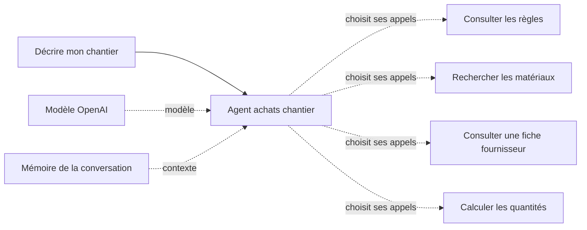

# Présenter l'Agent IA achats chantier

**Scénario principal affiné :** [une salle de bains de 4 m sur 3 m avec une seule demande](DEMO-SALLE-DE-BAINS.md). Le mode `bathroom` calcule sol et doublage des quatre murs avec des hypothèses annoncées. Les exemples de cloison ci-dessous conservent leur intérêt pour expliquer les fonctions et les essais initiaux.

Ce guide explique la conception du workflow et propose une démonstration d'entretien. Les exemples chiffrés ci-dessous sont **théoriques**, établis à partir du catalogue du 4 octobre 2026 et des formules du code. Ces valeurs ont aussi été obtenues lors des exécutions réelles 78 et 79. Les preuves et la portée des essais figurent dans [le rapport de validation](VALIDATION.md).

## Une phrase pour présenter le projet

> « J'ai développé avec assistance un assistant qui prépare une liste de matériaux à partir d'une conversation. Il pose les questions manquantes, consulte des règles et des références sourcées, puis confie les quantités à un calculateur contrôlé. Il prépare une estimation partielle à vérifier avant achat. »

Le problème métier est concret : « refaire une pièce en placo » ne dit pas s'il faut créer une cloison, doubler un mur ou intervenir au plafond. La pièce, les faces exposées, les dimensions, les ouvertures et la finition changent aussi le besoin. Le workflow commence donc par préciser le chantier.

## Comment lire le dessin n8n

Le générateur crée **huit nœuds fonctionnels**, plus deux notes visuelles. Un lien principal transmet le message du chat à l'agent. Les connexions du modèle, de la mémoire et des outils donnent à cet agent ses capacités ; elles ne représentent pas une liste de quatre appels obligatoirement exécutés dans le même ordre.

Les noms du schéma sont ceux de [build-workflow.mjs](../build-workflow.mjs). Les deux notes, **Lire ce workflow** et **Sources et calculs**, expliquent le dessin ; elles ne traitent pas les données.

## Les huit nœuds, un par un

### 1. Décrire mon chantier

**Rôle : recevoir le message de l'utilisateur.** C'est le déclencheur de chat n8n. Le message est envoyé à l'agent avec l'identifiant de session. La réponse de l'agent est ensuite affichée dans le chat.

Le chat accueille du texte ; les fichiers sont désactivés. Sa configuration actuelle utilise un chat hébergé par n8n, sans authentification au niveau de ce déclencheur : c'est une configuration de démonstration locale, pas une gestion de comptes clients. Le chargement de sessions précédentes n'est pas proposé dans cette interface.

À expliquer à l'écran : « Ici, je donne le besoin en langage naturel. Je ne demande pas à l'artisan de remplir un objet technique ou de connaître les identifiants de produits. »

### 2. Agent achats chantier

**Rôle : conduire la conversation et choisir les outils utiles.** Il reçoit le message, le contexte de session et les consignes chargées depuis [agent-prompt.txt](../agent-prompt.txt).

Les consignes lui demandent notamment de distinguer cloison, doublage et plafond, de qualifier l'humidité et de consulter les règles avant un chiffrage. Il doit rechercher des références réelles du catalogue et transmettre les paramètres confirmés au calculateur.

L'agent peut demander une précision au lieu de calculer. Après un résultat d'outil, il peut s'en servir pour son prochain appel : par exemple, récupérer un identifiant de plaque dans la recherche, puis le transmettre à la fiche produit et au calculateur. Une modification du chantier exige un nouveau calcul.

La configuration limite la boucle à **8 itérations** et demande le retour des étapes intermédiaires. Dans une exécution, montrer les appels réellement effectués et leurs résultats est plus probant que d'affirmer que l'agent a utilisé tous ses outils. L'ordre exact et la formulation des questions peuvent varier selon le modèle.

### 3. Modèle OpenAI

**Rôle : comprendre les messages et produire les décisions d'appel et la réponse.** Le modèle configuré est `gpt-5.6-terra`, via le nœud OpenAI avec l'API Responses activée.

Les options demandent un effort de raisonnement `low`, un délai de 60 secondes, au plus une nouvelle tentative selon la gestion du nœud, et `store:false` dans le corps supplémentaire. Ce dernier paramètre ne constitue pas, à lui seul, une promesse générale d'absence de toute conservation de données.

La connexion OpenAI est attachée à l'import local par les identifiants n8n. La clé n'apparaît pas dans l'export public du workflow et n'a pas à être montrée pendant l'entretien.

À expliquer : « Le modèle interprète le besoin et choisit ses appels. Les prix et le calcul final ne dépendent pas d'un nombre qu'il inventerait dans sa réponse. »

### 4. Mémoire de la conversation

**Rôle : conserver un contexte récent pendant l'échange.** Le nœud utilise l'identifiant de session du chat comme clé. Sa fenêtre de contexte est configurée à `8`.

Cela permet de comprendre une suite comme « Et si cette cloison est dans une salle de bains ? » sans redemander immédiatement toutes les dimensions. La mémoire reste un contexte de conversation limité. Elle ne remplace ni un dossier chantier durable, ni une base de données de devis, ni un calcul actualisé.

À montrer : après le premier exemple, modifier seulement l'usage de la pièce. L'agent doit conserver les informations encore valables, demander les précisions nouvelles et recalculer avec les matériaux appropriés.

### 5. Consulter les règles

**Rôle : obtenir le périmètre, les questions et les hypothèses de calcul.** Cet outil envoie le type de projet et de pièce à `POST /tools/rules` du service `chantier-api`.

La fonction `selectRules` de [quantities.mjs](../quantities.mjs) sélectionne une règle de [rules.json](../rules.json). Elle renvoie notamment le statut, les champs requis, le système géométrique retenu lorsqu'il existe, les limites et les liens sources. Une pièce non qualifiée entraîne une demande d'information ; un plafond sort du périmètre.

Pour la cloison simple retenue, les paramètres recommandés décrivent deux faces, une plaque par face et un gabarit M48/R48. Ils servent au métré estimatif. Ils ne certifient pas un assemblage multimarque ni sa pose.

Le scénario historique de cloison seule demande un usage privatif explicite et une zone hors projections directes. Le mode pièce entière propose une estimation provisoire et distingue la protection de la douche des matériaux de base. La classe H1 concerne les plaques ; elle ne valide pas une étanchéité complète. Le mode pièce entière possède désormais un gabarit de doublage distinct à une face et montants doublés. Un doublage isolé hors de ce gabarit conserve un statut demandant une validation de système : l’ossature d’une cloison n’est jamais réutilisée silencieusement.

### 6. Rechercher les matériaux

**Rôle : retrouver des références dans le catalogue sélectionné.** Cet outil appelle `POST /tools/search` avec une recherche textuelle.

Le service retire les accents pour comparer les mots, recherche dans les identifiants, noms, catégories et éventuels mots-clés, puis classe les correspondances. C'est une recherche lexicale dans **un catalogue sélectionné de plusieurs fournisseurs**, pas une navigation dans tout Leroy Merlin, une recherche globale du Web ou une recherche vectorielle.

Le résultat fournit les identifiants exacts, les noms, les dimensions, les conditionnements, les prix datés et leurs sources. L'agent doit réutiliser ces identifiants pour ses appels suivants. Il ne peut pas inventer une référence absente et attendre que le calculateur l'accepte.

À montrer : chercher des plaques puis comparer la standard avec la H1. La différence est explicitement présente dans les données, au lieu d'être déduite de la seule couleur d'une image.

### 7. Consulter une fiche fournisseur

**Rôle : lire le détail d'une référence déjà trouvée.** L'outil appelle `POST /tools/product` avec un identifiant du catalogue. Avec `refresh:false`, il retourne le relevé daté. Avec `refresh:true`, il tente une lecture de la fiche fournisseur autorisée.

Le serveur utilise l'URL de cette référence dans le catalogue. L'agent ne transmet pas une adresse arbitraire à télécharger. La lecture est bornée en temps et en taille ; les redirections sont refusées.

Le code ne reconnaît un prix récent que s'il retrouve une identité de produit, une offre unique en euros et une unité de prix explicitement compatible avec un paquet. Un prix au mètre carré pris pour un carton serait une erreur importante : en cas d'ambiguïté ou de blocage fournisseur, le service conserve le relevé et indique l'échec de vérification.

**Même si un prix récent est vérifié, il reste affiché séparément : cet appel ne modifie pas le catalogue et le calculateur utilise toujours ses prix datés.** Aucun stock local n'est confirmé. Cette distinction évite de mélanger un total de relevé avec une promesse de prix en direct.

### 8. Calculer les quantités

**Rôle : calculer les quantités d'achat et les sous-totaux avec des règles explicites.** L'agent prépare l'objet de paramètres ; l'outil appelle `POST /tools/estimate`.

La fonction `estimate` de [quantities.mjs](../quantities.mjs) ne fait aucun appel au modèle. Elle contrôle les champs et unités, les références, leurs catégories, les paramètres d'ossature, la hauteur, les ouvertures et la marge. Pour une salle de bains, elle exige les paramètres d'usage et d'exposition, puis une plaque H1. Une finition carrelée ou lourde sort du système de cloison actuellement calculé.

Elle renvoie soit des quantités, soit des questions, soit un motif de refus. Le mode salle de bains combine sol et murs ; il distingue les valeurs fournies des hypothèses, et peut conserver le sol chiffré lorsque le système de murs est hors périmètre. Les montants d'achat proviennent du prix des conditionnements entiers et les sous-totaux monétaires sont calculés en centimes. Si un prix manque, le total complet reste inconnu : le prix absent n'est pas remplacé par zéro.

La réponse contient aussi les hypothèses et les exclusions. L'agent doit les restituer de façon compréhensible ; un total partiel ne devient pas le prix de rénovation de toute la pièce.

## Pourquoi c'est un agent avec des outils

L'agent dispose de plusieurs actions possibles. Il choisit celles qui sont utiles au message courant, lit leurs réponses et peut adapter l'étape suivante. Une question sur la différence standard/H1 demande surtout les règles et les produits ; une estimation exige des dimensions et un calcul ; une modification de pièce change les vérifications nécessaires.

Le serveur d'outils garde les opérations sensibles au métier dans du code relisible : prix de catalogue, unités, compatibilités élémentaires, calculs et limites. Cette séparation réduit les erreurs possibles, mais ne supprime pas toute erreur d'interprétation. Si le modèle transmet 40 mètres alors que l'utilisateur a dit 4, un nombre techniquement valide peut rester sémantiquement faux. C'est pourquoi la réponse rappelle les hypothèses et doit permettre à l'utilisateur de les corriger.

Il faut aussi distinguer une consigne et un contrôle : demander dans le prompt de consulter les règles dirige le modèle ; refaire des vérifications dans le calculateur protège le calcul même si un appel arrive avec des paramètres incorrects.

## Scénario de démonstration : chambre, puis salle de bains

### Premier message : la chambre

> « Je veux créer une cloison intérieure non porteuse de 4 m de long et 2,50 m de haut dans une chambre. Elle est droite, sans porte ni fenêtre, avec une finition peinte et une isolation acoustique de 45 mm. Prépare une estimation avec les références du catalogue et 10 % de marge. »

Laisser l'agent consulter les règles et poser ses questions. Il doit présenter l'hypothèse d'ossature du métré, puis faire confirmer ce qui manque. Pour cette démonstration, si cette hypothèse est proposée, répondre :

> « Pour cet exemple estimatif, retiens des montants M48 simples à entraxe 60 cm, des rails R48 et une plaque BA13 sur chaque face. Je ferai valider le système complet et les fixations avant les travaux. »

Ouvrir ensuite l'exécution et montrer les **appels réellement présents** : les références trouvées, les paramètres envoyés au calculateur et le résultat. Ne pas annoncer à l'avance un nombre d'appels garanti.

### Exemple théorique de calcul pour cette chambre

Hypothèses : aucun vide, hauteur 2,50 m, une couche par face, plaques de 1,20 × 2,50 m, rails de 3 m, montants de 2,50 m, marge de 10 % appliquée par le calculateur.

| Poste | Raisonnement théorique | Achat théorique | Sous-total au relevé |
| --- | --- | ---: | ---: |
| Plaques standard | Surface de paroi : 4 × 2,5 = 10 m². Deux faces et marge : 22 m². Arrondi par plaque : 8 ; minimum par largeur de pan : 4 par face, soit aussi 8. | 8 plaques, soit 24 m² | 65,52 € |
| Rails | Haut et bas : 2 × arrondi supérieur de 4 / 3 = 4 rails avant marge. Avec 10 %, arrondi à 5. | 5 rails de 3 m | 19,00 € |
| Montants | Arrondi supérieur de 4 / 0,6 + 1 = 8 montants avant marge. Avec 10 %, arrondi à 9. | 9 montants de 2,5 m | 34,20 € |
| Isolant | Une seule cavité : 10 × 1,10 = 11 m². Un lot couvre 15,6 m². | 1 lot de 15,6 m² | 51,79 € |
| **Total partiel théorique** | Prix du 04/10/2026, hors postes exclus. | | **170,51 €** |

La marge demandée n'est pas égale au surplus finalement acheté : l'arrondi au paquet entier peut augmenter ce surplus. Les deux faces ne doublent pas l'isolant, car il n'y a qu'une cavité. La longueur brute des rails n'est pas une optimisation complète des chutes.

### Deuxième message : modifier l'usage

> « Garde les dimensions et l'isolation. Un côté de la cloison donne maintenant sur une salle de bains privative, l'autre sur une chambre. La zone est hors projections directes de douche ou de baignoire, avec une finition peinte. Qu'est-ce qui change ? »

L'agent doit réexaminer les règles humides et rechercher la référence H1. La V1 utilise une seule référence de plaque pour toute la cloison : il faut expliquer le choix conservateur H1 sur les deux faces et le faire comprendre à l'utilisateur. Ce choix n'est pas une obligation universelle pour le côté chambre.

Pour poursuivre l'exemple :

> « D'accord pour chiffrer la même plaque H1 sur les deux faces dans cette estimation. Garde les autres hypothèses. »

**Calcul théorique avec cette hypothèse** : 8 plaques H1 à 20,91 €, soit 167,28 € de plaques. Les autres postes restent à 104,99 €. Le total partiel devient **272,27 €**, soit **101,76 €** de plus que la version standard. Un nouvel appel au calculateur doit produire le résultat réellement affiché dans le chat.

La conclusion métier attendue reste mesurée : H1 résiste à l'humidité dans un système adapté ; les joints, pieds, traversées et finitions restent à définir. Le workflow ne promet ni étanchéité complète ni conformité générale du chantier.

### Montrer une limite utile

On peut ensuite demander :

> « Et si je pose du carrelage 60 × 60 sur cette cloison ? »

Le système de cloison actuel refuse cette finition. Le guide Placo impose notamment un entraxe plus faible pour les grands carreaux sur simple parement. L'agent doit expliquer la limite et demander une validation adaptée, sans simplement ajouter des cartons au devis précédent. Le métré de carreaux seuls est un autre périmètre de calcul ; il ne valide pas leur support.

## Les fichiers à ouvrir si l'intervieweur demande le code

| Fichier | Ce qu'il permet d'expliquer |
| --- | --- |
| [build-workflow.mjs](../build-workflow.mjs) | Création reproductible des nœuds, connexions, descriptions d'outils et options du modèle. |
| [workflow.json](../workflow.json) | Export du workflow destiné à l'import n8n. |
| [agent-prompt.txt](../agent-prompt.txt) | Comportement conversationnel, questions, choix des outils et limites de formulation. |
| [server.mjs](../server.mjs) | Routes HTTP, recherche du catalogue, lecture fournisseur bornée, validation des requêtes et erreurs. |
| [quantities.mjs](../quantities.mjs) | Fonctions pures de sélection des règles et de calcul ; unités, arrondis, conditionnements, sous-totaux et refus. |
| [catalog.json](../catalog.json) | Références, liens, dates, prix, dimensions et métadonnées produit. |
| [rules.json](../rules.json) | Périmètre explicite, hypothèses, sources fabricants et questions nécessaires. |
| [SOURCES.md](SOURCES.md) | Justification des références et différence entre donnée datée, usage filtré et validation technique. |

Pour un échange technique, ouvrir d'abord `estimate` et suivre un exemple simple. Montrer ensuite un cas refusé. Le but est de rendre le raisonnement vérifiable, sans parcourir chaque ligne du serveur.

## Réponses courtes aux questions probables

**« Pourquoi ne pas laisser le modèle tout calculer ? »** Le code rend les unités et les arrondis reproductibles. Le modèle garde la compréhension et la conversation ; il transmet les calculs à l'outil.

**« Est-ce une recherche fournisseur en direct ? »** La recherche parcourt une sélection datée. Une fiche peut faire l'objet d'une tentative de vérification séparée ; le total du calculateur reste fondé sur le catalogue. Les stocks ne sont pas vérifiés.

**« Que se passe-t-il si une information manque ? »** L'outil renvoie les champs manquants et les questions correspondantes. L'agent doit revenir vers l'utilisateur, pas remplir une dimension au hasard.

**« Que faudrait-il ajouter pour un usage professionnel élargi ? »** Étendre et faire valider les systèmes métier, gérer les variantes et les mises à jour fournisseur, conserver des dossiers et validations durables, et adapter l'authentification et l'exploitation au déploiement visé. Ces éléments ne sont pas présentés comme déjà réalisés.

**« Quels tests ont réussi ? »** Montrer uniquement le rapport et les exécutions disponibles au moment de l'entretien. Le [rapport de validation](VALIDATION.md) présente 27 tests de code et les quatre tours réels de conversation vérifiés.
