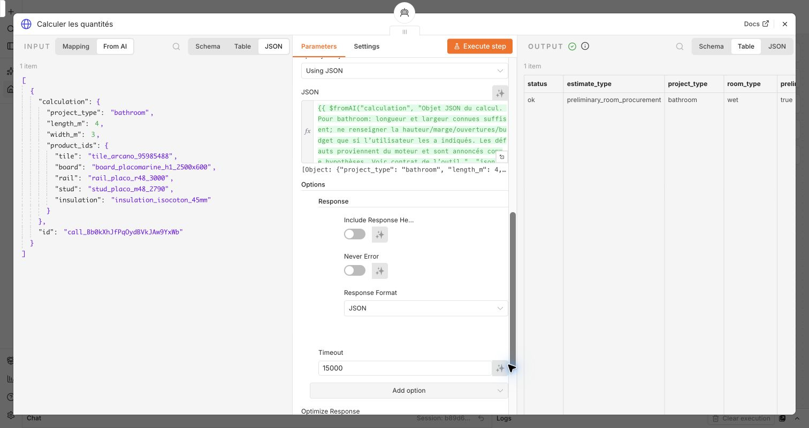

# Règles métier et calculs — comprendre et expliquer le code

Ce guide décrit le code réellement utilisé par l’agent achats chantier, version `chantier-v2-bathroom`, avec le catalogue relevé le **4 octobre 2026**. Les exemples numériques ont été recalculés le **5 octobre 2026** en appelant directement les fonctions JavaScript, sans appel au modèle et sans modifier le workflow.

L’idée à retenir : **le modèle comprend la demande et choisit ses outils ; le programme décide si le cas est couvert, calcule les quantités et associe les prix aux conditionnements.** Le résultat est une estimation des matériaux sélectionnés, sous hypothèses explicites.

## 1. Ce que tu montres dans n8n

Ouvre la brique **Calculer les quantités**, puis son corps JSON. Cette expression est le passage entre le raisonnement de l’agent et le calcul déterministe :

```javascript
={{ $fromAI("calculation", "Objet JSON du calcul…", "json") }}
```

L’extrait abrège seulement le texte descriptif. `$fromAI` demande au modèle de construire un objet de paramètres. Il ne calcule pas les métrés et ne garantit pas que les valeurs proposées respectent les règles métier. Ces contrôles sont exécutés par l’API.



Pour « Je refais ma salle de bains de 4 m sur 3 m », l’appel minimal accepté par le calculateur est :

```json
{
  "project_type": "bathroom",
  "length_m": 4,
  "width_m": 3
}
```

L’agent peut aussi transmettre les identifiants de produits qu’il a consultés. Il doit laisser les dimensions et préférences inconnues absentes, pour que le serveur puisse les marquer comme hypothèses. L’utilisateur n’a pas à connaître les identifiants techniques.

À dire : « Ce JSON est un contrat entre l’agent et mon API. Même si l’IA envoie une valeur incorrecte, mon code ne lui fait pas confiance : il vérifie les types, les dimensions, les références et le périmètre avant de calculer. »

## 2. Consigne au modèle, règle métier, formule : trois choses différentes

| Élément | Exemple du projet | Où il vit | Pourquoi le séparer |
| --- | --- | --- | --- |
| Consigne au modèle | Consulter les outils, annoncer les hypothèses et ne pas présenter le montant comme un devis complet. | [agent-prompt.txt](../agent-prompt.txt) | Organiser la conversation et la présentation. Une consigne peut être mal suivie ; elle ne suffit pas comme contrôle. |
| Règle métier | Le gabarit de murs de cette salle de bains est limité à 2,50 m, avec une face, une couche, une finition légère et des montants doublés à entraxe maximal 0,60 m. | [rules.json](../rules.json), puis contrôles de [quantities.mjs](../quantities.mjs) | Définir ce que cette application accepte effectivement de chiffrer. |
| Formule de calcul | Nombre de cartons = arrondi supérieur de la surface avec marge divisée par la couverture d’un carton. | `estimate` dans [quantities.mjs](../quantities.mjs) | Obtenir une quantité reproductible, sans demander au modèle de faire l’arithmétique. |
| Donnée fournisseur | Un carton Arcano contient 3 carreaux et couvre 1,08 m² ; le relevé retient 11,77 € le carton. | [catalog.json](../catalog.json) | Conserver prix, unité, conditionnement, date et source ensemble. |

**Attention au mot « règle » :** le document JSON contient aussi des descriptions, conditions et repères documentaires. Ce n’est pas un moteur générique qui exécute automatiquement toutes les phrases de `conditions` ou `quantity_policy`. Les règles appliquées sont celles que `selectRules` sélectionne et que `estimate` contrôle explicitement. Les formules exécutables sont dans JavaScript.

Les champs `reference_systems` du doublage générique sont des repères ; ils n’autorisent pas automatiquement ce doublage. De même, le texte historique `quantity_policy.stud_packs` décrit la V1 à montants simples ; le code actuel utilise `framing.stud_multiplier`, qui vaut **2** pour la salle de bains.

À dire : « Le prompt guide le modèle. Les règles métier et les formules sont appliquées par un programme testable. Modifier le prompt ne permet pas de supprimer la limite de hauteur du calculateur. »

## 3. Où se trouve chaque responsabilité

Le module [quantities.mjs](../quantities.mjs) ne lit pas de fichier, n’appelle aucun site et n’interroge aucun modèle. Il reçoit les données en arguments et renvoie un objet. C’est ce qui permet de le tester indépendamment de n8n, d’OpenAI et des fournisseurs.

| Fonction ou aide | Ce qu’elle fait exactement | Pourquoi elle existe |
| --- | --- | --- |
| `object` | Accepte un objet non nul et non tableau. | Refuser un texte ou une liste à la place d’un contrat JSON. |
| `absent` | Repère `undefined`, `null` ou la chaîne vide. | Distinguer une donnée manquante de `0` ou `false`, qui peuvent être des choix valides. |
| `finite` | Exige un vrai nombre JavaScript, fini et compris entre deux bornes. | Refuser `"4"`, `NaN`, `Infinity` ou une dimension hors limites, sans conversion implicite. |
| `round` | Arrondit un nombre à un nombre donné de décimales, 3 par défaut. | Rendre les métrés lisibles ; les résultats de surface emploient souvent 4 décimales. |
| `ceil` | Arrondit au supérieur avec une tolérance de `1e-10`. | Acheter des conditionnements entiers sans ajouter une unité à cause d’un artefact binaire minuscule. |
| `information` | Déduplique les champs manquants et construit des questions ciblées. | Permettre à l’agent de demander précisément l’information absente. |
| `invalid` | Renvoie `invalid_input` et une liste `issues` avec champ et message. | Expliquer une donnée incorrecte, sans produire de faux calcul. |
| `unsupported` | Renvoie `unsupported` et un motif. | Signaler un cas hors du périmètre de ce prototype. |
| `selectRules` — exportée | Sélectionne le périmètre projet/pièce, ses champs attendus, sources et limites. | Donner à l’agent un contrat et au calculateur une politique de référence. |
| `estimate` — exportée | Oriente le scénario, valide les données et produits, calcule carrelage ou parois, puis les prix. | Centraliser le calcul vérifiable. |
| `estimateBathroom` — interne | Construit une pièce rectangulaire, trace les hypothèses, appelle le calcul de sol et celui de doublage, puis les agrège. | Accepter une demande courte tout en gardant les hypothèses et les lots non chiffrés visibles. |
| `parameter` — interne à la salle de bains | Choisit une valeur reçue ou un défaut et consigne son origine. | Ne pas présenter une hauteur supposée comme une dimension confirmée. |
| `publicPrice` | Contrôle un prix en EUR par paquet, à deux décimales, et conserve sa source/date/nature. | Éviter de confondre prix au m² et prix du conditionnement. |
| `line` | Produit une ligne : besoin, paquets, unités achetées, couverture, prix, coût et formule. | Garder la preuve du passage du métré à la liste d’achat. |
| `totals` | Additionne les prix connus, conserve les prix inconnus et compare au budget. | Ne pas transformer une donnée absente en zéro ni annoncer un total complet incomplet. |

`estimateBathroom` réutilise `estimate` pour ses deux lots. Cela évite d’avoir une formule de cartons dans le mode carrelage et une autre dans le mode salle de bains. L’API ajoute ensuite l’export PDF ; la génération de PDF n’appartient pas à ces fonctions de calcul.

## 4. L’arbre de décision réellement appliqué

### Choix du projet

1. L’entrée doit être un objet JSON avec uniquement les champs reconnus.
2. Les projets connus sont `tiling` (carrelage), `partition` (cloison), `lining` (doublage) et `bathroom` (pièce rectangulaire).
3. `bathroom` suit son propre chemin de première estimation. Les autres projets suivent le contrat plus détaillé du métré isolé.
4. Un projet inconnu est `unsupported`. Un champ inattendu produit `invalid_input`.

### Règles par cas

| Projet | Pièce sèche `dry` | Pièce humide `wet` | Pièce inconnue |
| --- | --- | --- | --- |
| Carrelage `tiling` | Calcul permis sous contrôles de surface, marge et référence. | Calcul limité à une salle de bains privative et au périmètre déclaré hors projection directe pour cet outil isolé. | Demander `room_type`. |
| Cloison `partition` | Gabarit à deux faces, une couche, montants simples, finition légère, hauteur ≤ 2,50 m. | Même géométrie, avec contrôles de l’usage, de l’exposition et du parement H1. | Demander `room_type`. |
| Doublage `lining` générique | `needs_information` : aucun système générique n’est automatiquement activé. | Même blocage de périmètre, complété par le contexte humide. | Demander `room_type`. |
| Salle de bains `bathroom` | Contradiction : `invalid_input`. | Gabarit de pièce rectangulaire sous hypothèses explicites. | Le projet salle de bains permet le gabarit humide ; l’exposition à l’eau peut rester inconnue. |

`selectRules` vérifie seulement les champs `project_type` et `room_type`. Il décrit les autres paramètres à demander ; il ne vérifie pas encore toutes les dimensions ni tous les produits. **Le statut `allowed` signifie « cette famille de calcul existe », pas « tout ce chantier est validé ».**

Pour une cloison ou un carrelage isolé en milieu humide, `estimate` exige `room_usage: "private_bathroom"` et `water_exposure: "outside_direct_spray"`. Piscine, local humide public et projection directe sont hors de ce calcul isolé. Les informations manquantes déclenchent une question.

Le mode `bathroom` est volontairement différent : il peut conserver `water_exposure: "unknown"`, `"direct_shower_spray"` ou `"shower_tray"` et fournir les **matériaux de base seulement**. Il consigne le contexte, mais n’étudie ni le receveur, ni l’étanchéité, ni la protection de la zone exposée. Ses sous-appels utilisent un périmètre de métré hors projection pour les seuls postes chiffrés : cela ne requalifie pas la salle de bains entière comme étant hors projection.

### Doublage de salle de bains : le périmètre dédié

La règle `bathroom_private_initial_estimate` apporte un gabarit documentaire précis. La fonction en fait une copie locale pour le sous-calcul des murs ; elle ne modifie ni le fichier de règles ni l’autorisation des doublages génériques.

Le gabarit retient : quatre murs existants, une face visible, une couche de plaque H1, rails et montants de la famille PLACO retenue, montants doublés, entraxe 0,60 m, hauteur maximale 2,50 m, finition légère. Les compatibilités de références sont vérifiées par leurs identifiants de système dans le catalogue.

**Hydrofuge H1 ne signifie pas étanchéité complète.** Le logiciel ne déduit pas de cette seule classe que les joints, pieds, traversées, supports et protections à l’eau sont traités. Il ne calcule pas de performance acoustique, thermique, mécanique ou coupe-feu.

## 5. Comment une demande courte devient un calcul explicite

Pour `bathroom`, seules longueur et largeur sont obligatoires. Le serveur complète et expose les choix suivants :

| Paramètre | Si l’utilisateur ne le fournit pas | Conséquence visible |
| --- | --- | --- |
| `height_m` | 2,50 m | Hauteur supposée, à mesurer. |
| `margin_pct` | 10 % | Réserve estimative de découpes, modifiable ; aucune obligation normative. |
| `openings` | `[]` | Aucune ouverture déduite faute de relevé. Cela ne signifie pas « aucune porte ». |
| `include_insulation` | `true` | Provision d’isolant, sans performance garantie. |
| `wall_finish` | `light` | Finition légère supposée ; peinture et consommables non chiffrés. |
| `room_usage` | `private_bathroom` | Usage privatif présumé à confirmer. |
| `water_exposure` | `unknown` | Douche et protections à préciser séparément. |
| `shower_footprint_m2` | 0 | Aucun receveur non mesuré déduit du sol ; aucune pose de carrelage dans le receveur validée. |
| `product_ids` | Références recommandées par le gabarit | Références proposées, à vérifier avant achat. |

Les valeurs de hauteur, marge, isolation et finition viennent de `default_parameters` de la règle, avec un repli défini dans le code. Les longueurs des quatre murs sont dérivées du rectangle. Le système d’ossature et l’entraxe viennent de `framing` ; le mode pièce ne permet pas au modèle d’en injecter d’autres par des champs libres.

Extrait exact de `parameter` :

```javascript
const provided = input[field] !== undefined && input[field] !== null && input[field] !== '';
effective[field] = provided ? input[field] : fallback;
```

Chaque valeur est ensuite enregistrée dans `assumption_origins` avec `origin: "provided"`, `"default"` ou `"derived"`.

- `provided` signifie **reçu par le calculateur**, pas « vérifié sur le chantier » ni nécessairement « saisi par le client ». Une référence sélectionnée par l’agent est aussi une valeur reçue.
- `default` signifie hypothèse du gabarit.
- `derived` signifie calculé à partir d’autres valeurs, par exemple les quatre longueurs de murs.

Si l’agent envoie arbitrairement `height_m: 2.5`, le serveur ne peut pas deviner que cette hauteur était inconnue. Le prompt et l’inspection des appels complètent donc la validation des types : **la traçabilité des arguments n’est pas une preuve de leur origine humaine.**

## 6. Les contrôles avant de multiplier

### Contrat du mode salle de bains

| Donnée | Contrôle réel |
| --- | --- |
| Longueur et largeur | Nombres entre 0,10 et 100 m ; obligatoires. |
| Hauteur | Nombre entre 0,10 et 20 m pour représenter la pièce. Le lot de murs reste limité à 2,50 m. |
| Marge | Nombre de 0 à 30 %. |
| Budget | Nombre entre 0 et 1 000 000 €, au maximum deux décimales. |
| Isolation | Booléen `true` ou `false`. Une référence d’isolant avec `include_insulation: false` est contradictoire. |
| Finition | `light`, `tile`, `heavy` ou `unknown`. Seule `light` permet le lot de murs actuel. |
| Empreinte du receveur | Nombre ≥ 0, laissant au moins 0,01 m² de sol après déduction. |
| Ouvertures | Liste de 0 à 100 objets ; `wall_index` entier de 0 à 3, largeur et hauteur positives contenues dans le pan. |
| Références | Objet optionnel avec seulement `tile`, `board`, `rail`, `stud`, `insulation` et des identifiants textuels non vides. |
| Champs supplémentaires | Refusés : par exemple `surface_m2` est interdit dans le mode pièce, qui exige ses dimensions. |

Les nombres doivent être des nombres JSON : `4` est accepté, `"4"` ne l’est pas. Ce choix évite de convertir silencieusement `"4 cm"`, `"4,5"` ou une autre unité. L’agent doit normaliser les unités avant l’appel, sans inventer de mesure.

Pour les ouvertures, le programme cumule les surfaces et les largeurs par pan. Une surface d’ouverture égale ou supérieure à celle du mur, ou une largeur cumulée excessive, est refusée. Il ne connaît pas la position horizontale de chaque ouverture : chevauchement, linteau et implantation ne sont pas modélisés.

### Contrôles propres aux lots et produits

Pour un carrelage isolé : surface de 0,01 à 10 000 m², couverture positive et vérifiée du paquet, aucune donnée d’ossature inutile. Pour les parois : 1 à 50 pans de 0,05 à 100 m, hauteur de 0,10 à 2,50 m, entraxe de 0,10 à 0,60 m, puis limites du système choisi.

Chaque produit doit exister dans le catalogue, être de la bonne catégorie, être déclaré compatible avec le type de projet et, en humide, avec `wet`. Le conditionnement doit contenir un entier positif d’unités.

Pour les murs, le code vérifie aussi :

- le même identifiant de système déclaré pour plaque, rail et montant ; il n’infère pas une compatibilité à partir du seul nom commercial ;
- une plaque explicitement H1 en pièce humide ;
- une plaque et un montant vendus dans une hauteur suffisante : aucun raccord vertical ou raboutage automatiquement calculé ;
- la cohérence entre les dimensions des plaques et la couverture annoncée du paquet ;
- l’épaisseur d’isolant compatible avec la largeur déclarée des profils, son système et sa couverture de lot.

Ces métadonnées sont un filtre documentaire du catalogue, pas une certification du système posé.

## 7. Les formules, ligne par ligne, sur la salle de bains 4 × 3 m

### A. Géométrie de départ

Extrait exact :

```javascript
const floorArea = input.length_m * input.width_m;
const wallLengths = [input.length_m, input.width_m, input.length_m, input.width_m];
```

Avec hauteur supposée 2,50 m :

| Mesure | Calcul | Résultat |
| --- | --- | --- |
| Sol brut | `4 × 3` | 12 m² |
| Pans | `[4, 3, 4, 3]` | Quatre murs |
| Périmètre | `2 × (4 + 3)` | 14 m |
| Murs bruts | `14 × 2,50` | 35 m² |
| Ouvertures déduites | Aucune mesure reçue | 0 m² déduit, sous hypothèse |
| Murs nets de l’estimation | `35 − 0` | 35 m² |
| Coefficient de marge | `1 + 10 / 100` | 1,10 |

Une cloison indépendante a deux faces ; le doublage des murs existants en a une. L’isolation remplit une cavité, quel que soit le nombre de faces de parement.

### B. Carrelage : surface vers cartons

Extrait exact :

```javascript
const withMargin = input.surface_m2 * factor;
const packs = ceil(withMargin / tile.pack.coverage_m2);
```

Le carton Arcano couvre 1,08 m². Calcul : `ceil(12 × 1,10 / 1,08) = ceil(12,222…) = 13 cartons`.

Le besoin avec marge est de **13,20 m²**. L’achat réel couvre **14,04 m²**, soit 39 carreaux (3 par carton). La marge appliquée au besoin ne garantit donc pas exactement 10 % de surplus acheté : les paquets complets créent aussi un excédent.

### C. Plaques : retenir le besoin surfacique et le minimum par pan

Extrait exact :

```javascript
const boardSurface = netArea * faces * factor;
const surfaceBoards = ceil(boardSurface / boardArea);
const geometricBoards = input.wall_lengths_m.reduce((sum, length) => sum + ceil(length / board.pack.width_m) * faces, 0);
const boardUnits = Math.max(surfaceBoards, geometricBoards);
```

La Placomarine mesure 2,50 × 0,60 m : une plaque couvre 1,50 m².

1. Besoin surfacique : `ceil(35 × 1 × 1,10 / 1,50) = 26 plaques`.
2. Minimum géométrique par pan : `ceil(4/0,60) + ceil(3/0,60) + ceil(4/0,60) + ceil(3/0,60) = 7 + 5 + 7 + 5 = 24 plaques`.
3. Maximum retenu : `max(26, 24) = 26 plaques`, soit 39 m² achetés.

Pourquoi deux calculs ? Une surface globale ne prouve pas que les largeurs disponibles couvrent correctement chaque mur. Le minimum par pan évite de supposer un réemploi parfait des chutes entre murs. La marge n’est pas appliquée une deuxième fois au résultat : elle est dans le besoin surfacique ; le minimum géométrique est une borne distincte.

### D. Rails : compter haut et bas pour chaque pan

Extrait exact :

```javascript
const baseRailUnits = input.wall_lengths_m.reduce((sum, length) => sum + 2 * ceil(length / rail.pack.length_m), 0);
const railUnits = ceil(baseRailUnits * factor);
```

Chaque rail acheté mesure 3 m :

- pan de 4 m : `2 × ceil(4/3) = 4 rails` pour haut et bas ;
- pan de 3 m : `2 × ceil(3/3) = 2 rails` ;
- quatre pans : `4 + 2 + 4 + 2 = 12 rails` avant marge ;
- avec marge : `ceil(12 × 1,10) = 14 rails`, soit 42 m de profils achetés.

Le code ne se contente pas de `ceil(28 m / 3 m)`. Il provisionne chaque pan et chaque lisse sans optimiser toutes les chutes. Les portes ne sont pas soustraites aux rails ; les traverses et détails d’huisserie ne sont pas calculés.

### E. Montants : stations, rives, ouvertures, puis doublage

Extrait exact :

```javascript
const studMultiplier = framing.stud_multiplier ?? 1;
const studUnitsByWall = input.wall_lengths_m.map((length, i) => (ceil(length / input.stud_spacing_m) + 1 + 2 * openingCounts[i]) * studMultiplier);
const studUnits = ceil(studUnitsByWall.reduce((sum, count) => sum + count, 0) * factor);
```

Le gabarit salle de bains utilise entraxe 0,60 m et multiplicateur 2 :

- pan de 4 m : `(ceil(4/0,60) + 1) × 2 = (7 + 1) × 2 = 16 montants` ;
- pan de 3 m : `(ceil(3/0,60) + 1) × 2 = (5 + 1) × 2 = 12 montants` ;
- total : `16 + 12 + 16 + 12 = 56` avant marge ;
- achat : `ceil(56 × 1,10) = 62 montants`.

`ceil(longueur/entraxe)` compte les intervalles ; `+1` transforme le nombre d’intervalles en nombre de positions, avec les rives. Le multiplicateur 2 vient du gabarit de doublage. Les montants vendus en 2,79 m sont assez longs pour cette hauteur supposée ; ils sont à recouper, sans plan de coupe fourni.

Si une ouverture est ajoutée, `2 × openingCounts[i]` provisionne deux positions supplémentaires sur ce pan. Avec ce système doublé, cela ajoute quatre profils avant marge. Cette provision ne dimensionne pas un linteau, un renfort de porte ou des charges suspendues.

### F. Isolant : une seule cavité, par lots entiers

Extrait exact :

```javascript
const insulationArea = netArea * factor;
```

Le nombre de lots est `ceil(insulationArea / insulation.pack.coverage_m2)`. Le lot Isocoton contient 13 panneaux de 1,20 × 0,60 m, soit 9,36 m².

`ceil(35 × 1,10 / 9,36) = ceil(4,113…) = 5 lots`, donc **65 panneaux** et **46,80 m² achetés** pour un besoin avec marge de 38,50 m².

On ne multiplie pas l’isolant par le nombre de faces des plaques : il remplit une cavité. La couverture achetée dépasse la réserve de 10 % à cause de la taille du lot.

### G. Pourquoi `ceil` a une tolérance

Extrait exact :

```javascript
const ceil = value => Math.ceil(value - 1e-10);
```

Les nombres décimaux ne sont pas tous représentables exactement en binaire. Une opération censée donner 11 peut produire une valeur imperceptiblement supérieure ; `Math.ceil` seul retournerait alors 12. La soustraction de `1e-10` élimine uniquement ce bruit au voisinage d’un entier. Elle ne retire pas une marge de matériau significative.

Le calcul conserve la précision intermédiaire ; les arrondis lisibles de sortie ne remplacent pas les arrondis au supérieur des conditionnements.

## 8. Prix, centimes, budget : ce que signifie exactement le total

| Ligne | Quantité achetée | Prix relevé du paquet | Sous-total |
| --- | --- | --- | --- |
| Arcano | 13 cartons | 11,77 € | 153,01 € |
| Placomarine H1 | 26 plaques | 14,85 € | 386,10 € |
| Rail PLACO R48 | 14 rails | 8,10 € — prix conseillé | 113,40 € |
| Montant PLACO M48 | 62 montants | 5,50 € | 341,00 € |
| Isocoton 45 mm | 5 lots de 13 panneaux | 64,58 € | 322,90 € |
| **Matériaux sélectionnés** | | | **1 316,41 €** |

`publicPrice` accepte un montant entre 0 et 1 000 000, en EUR, dont l’unité vaut `pack`, avec au maximum deux décimales. Sinon le prix devient `null`, avec `status: "unavailable"`. Les prix valides restent `catalog_snapshot`, avec source, fournisseur, date et nature du relevé.

Extrait exact de `line` :

```javascript
const cents = price.amount === null ? null : Math.round(price.amount * 100) * packs;
```

Pour 13 cartons à 11,77 €, le programme calcule `1177 × 13 = 15301 centimes`, puis divise par 100 pour l’affichage. `totals` additionne également des centimes. Cela évite les petits artefacts d’addition de décimaux binaires.

Le champ `price_per_pack.basis` conserve notamment le fait que le rail est un **prix conseillé de revendeur**, pas un prix de caisse garanti. Le calcul lit ce catalogue daté. Une consultation en direct d’une fiche fournisseur ne modifie pas silencieusement le catalogue utilisé dans l’estimation.

### Lire les champs de résultat

| Champ | Interprétation correcte |
| --- | --- |
| `required_quantity` + `required_unit` | Besoin estimé : parfois m², parfois nombre de pièces. |
| `packs` | Nombre de conditionnements à acheter. |
| `units_per_pack` | Nombre d’unités contenues dans un conditionnement. |
| `purchased_units` | `packs × units_per_pack` ; par exemple 65 panneaux pour 5 lots. |
| `coverage_purchased_m2` | Surface couverte par tous les paquets, quand la donnée existe. |
| `total_eur` | Total complet des lignes/périmètre calculables ; `null` si prix ou lot manquant. |
| `known_subtotal_eur` | Somme des lignes dont le prix est connu. |
| `missing_prices` | Identifiants des lignes dont le prix manque. |
| `pricing_status` | `snapshot_complete`, `snapshot_partial` ou `scope_partial`. |
| `no_order_placed`, `no_payment` | Le calcul n’a déclenché ni achat ni paiement. |

Pour un budget de 1 000 €, le résultat complet contient :

```json
{
  "amount_eur": 1000,
  "status": "over_budget",
  "difference_eur": -316.41
}
```

La différence est **budget moins montant connu complet** : négative si dépassement. `within_budget` signifie uniquement que ces matériaux sélectionnés tiennent dans ce budget. Cela ne signifie pas que la rénovation complète tient dans le budget.

Sans budget : `not_provided`. Si un prix ou un lot manque : `cannot_determine`, avec différence `null`.

## 9. Quand un résultat est partiel — exemple à 2,70 m

Dans la même conversation, demande : **« En fait, la hauteur est de 2,70 m. »** L’agent doit rappeler le calculateur avec longueur 4, largeur 3 et hauteur 2,70 ; la mémoire seule ne recalcule rien.

La hauteur est une valeur valide pour décrire la pièce, mais le système de murs actuel n’est pas autorisé à cette hauteur. Le sol reste calculable.

Extrait exact :

```javascript
const fullScope = Object.values(components).every(result => result.status === 'ok');
```

Puis, si un lot n’est pas calculable :

```javascript
total.total_eur = null; total.pricing_status = 'scope_partial';
```

Résultat vérifié :

| Élément | Résultat à 2,70 m |
| --- | --- |
| Surface de sol | 12 m² |
| Surface brute de murs | 37,80 m² |
| `components.floor.status` | `ok` |
| `components.walls.status` | `unsupported` : hauteur au-delà de 2,50 m |
| Statut de l’ensemble | `partial` |
| `known_subtotal_eur` | 153,01 € pour le carrelage seul |
| `total_eur` | `null` |
| Budget si fourni | `cannot_determine` |

À dire : « Je garde la vraie hauteur. Je conserve le lot que je sais calculer et j’annonce explicitement ce que je ne sais pas chiffrer. Je ne présente jamais 153,01 € comme le coût des matériaux de toute la salle de bains. »

Le même principe s’applique si l’utilisateur demande un carrelage mural : `wall_finish: "tile"` rend les murs non chiffrables par ce gabarit à 600 mm ; le sol reste disponible. Le logiciel ne change pas automatiquement l’entraxe ni le système pour forcer un résultat.

## 10. Cas concrets pour comprendre les contrôles

Ces résultats ont été vérifiés par appels directs à `estimate`, sur le catalogue et les règles actuels. Ce sont des vérifications du calculateur, pas la promesse que le modèle appellera toujours ses outils dans le même ordre.

| Entrée ou variation | Résultat réel | Ce qu’il faut expliquer |
| --- | --- | --- |
| Salle de bains 4 × 3, rien d’autre | `ok`, 1 316,41 €, hypothèses exposées | Une première estimation est possible avec peu de saisie. |
| Largeur absente | `needs_information`, champ `width_m` | Poser une question sur la largeur ; aucune dimension inventée. |
| `length_m: "4"` | `invalid_input` | Le contrat exige un nombre, pas du texte. |
| `room_type: "dry"` dans une salle de bains | `invalid_input` | Refuser une contradiction de données. |
| Hauteur 2,70 m | `partial`, sous-total sol 153,01 €, total `null` | Dépasser une limite ne supprime pas le lot encore calculable. |
| Finition des murs `tile` | Même résultat partiel du sol | Le système de paroi doit être revu avant de chiffrer ce poste. |
| `water_exposure: "direct_shower_spray"` en mode pièce | Les matériaux de base restent calculés, avec exclusions des protections | Le mode pièce est une enveloppe provisoire ; il n’autorise pas une installation de douche. |
| Une porte de 0,83 × 2,04 m sur le pan 0 | 33,3068 m² de murs nets ; 25 plaques, 14 rails, 66 montants, 4 lots d’isolant ; total 1 258,98 € | Une ouverture diminue le parement mais augmente la provision de montants. L’implantation et les renforts restent à étudier. |
| Empreinte de receveur mesurée de 1,20 m² | Sol carrelé estimé 10,80 m² ; 11 cartons ; total matériaux 1 292,87 € | La déduction vient d’une donnée fournie, sans étude du receveur lui-même. |
| `include_insulation: false`, sans référence d’isolant | 4 lignes, 993,51 € | Le poste est retiré, avec limite explicite « isolation non incluse ». |
| Référence de plaque inexistante | Ensemble `partial`, `components.walls.status: "invalid_input"`, sol conservé | Le diagnostic détaillé est dans `components.walls.issues` ; l’agrégat signale le lot incomplet. |
| Prix du rail absent dans une copie du catalogue | `status: "ok"` pour les quantités, `pricing_status: "snapshot_partial"`, total `null`, sous-total connu 1 203,01 € | Un calcul de quantités réussi ne signifie pas que tous les prix sont disponibles. Un prix inconnu ne vaut pas zéro. |

Il faut donc lire ensemble **`status`**, **`pricing_status`** et **`components`**. Un seul indicateur ne décrit pas tous les aspects du résultat. Si plusieurs lots sont refusés, `partial` signifie périmètre incomplet ; il ne garantit pas à lui seul qu’un lot a produit des lignes.

## 11. Où sont les preuves et les limites

Les preuves sont les paramètres d’appel, le `rule_id`, les `measurements`, les formules de chaque ligne, les `assumption_origins`, les références du catalogue, les sources et les dates. Tu peux les montrer dans l’entrée et la sortie de la brique n8n.

Le catalogue est une sélection documentée de produits. Il ne représente ni tout Leroy Merlin, ni tout le marché. Les prix ne sont pas des devis, les stocks et la livraison ne sont pas vérifiés par le calcul. Les sources du projet sont recensées dans [SOURCES.md](SOURCES.md) et dans chaque règle et produit.

Le chiffre de 1 316,41 € exclut notamment vis, fixations, bandes, enduits, protections à l’eau, colle, joints, primaire, peinture, sanitaires, plomberie, électricité, ventilation, dépose, main-d’œuvre et livraison. La même réserve reste valable quand `status` vaut `ok` : « ok » porte sur **le périmètre calculé**, pas sur la rénovation entière.

Les formules sont des provisions d’achat. Elles n’optimisent pas les coupes et ne produisent pas un plan de pose. Les profils d’angle, détails d’ouvertures, supports, fixations, vapeur d’eau et assemblages exigent une vérification technique. La règle de 10 % est un choix de démonstration, pas une norme. La version actuelle ne délivre aucune conformité d’ouvrage.

Pour étendre le projet, il faut ajouter un système documenté, ses produits compatibles, ses contrôles et des cas de validation. Ajouter une phrase au prompt ou augmenter la puissance du modèle ne suffit pas à rendre un système constructif pris en charge.

## 12. Ton explication orale en deux minutes

1. **Dans Calculer les quantités** : « L’agent transforme la demande en paramètres. L’utilisateur donne 4 m sur 3 m ; les dimensions inconnues restent absentes. »
2. **Dans Consulter les règles** : « Une politique documentée définit les projets couverts. Pour cette pièce, les hypothèses sont annoncées : 2,50 m de hauteur, 10 % de marge, doublage H1 à une face. »
3. **Dans le résultat du calcul** : « Mon code calcule 12 m² au sol et 35 m² de murs. Il utilise les conditionnements réels : 13 cartons, 26 plaques, 14 rails, 62 montants et 5 lots d’isolant. Les montants sont doublés parce que le gabarit de doublage le prévoit. »
4. **Dans les prix** : « Les coûts viennent du catalogue daté et sont additionnés en centimes. Le total de 1 316,41 € concerne uniquement ces matériaux. Une donnée manquante reste inconnue. »
5. **Avec la hauteur 2,70 m** : « Le calcul conserve cette correction et refuse le lot hors périmètre. Il rend le sol et un sous-total connu explicite, puis l’agent explique la suite. »

Phrase de conclusion pour l’entretien : « L’autonomie de l’agent est dans le choix des outils et le dialogue. Les décisions de périmètre et les calculs restent traçables, reproductibles et testables. »

## 13. Reproduire un calcul sans le modèle

Depuis la racine du dépôt, ce code lit seulement les données locales et affiche le résultat. Il ne déclenche ni appel OpenAI, ni consultation fournisseur, ni création de PDF :

```javascript
import fs from 'node:fs';
import { estimate } from './chantier/quantities.mjs';

const catalog = JSON.parse(fs.readFileSync('./chantier/catalog.json', 'utf8'));
const rules = JSON.parse(fs.readFileSync('./chantier/rules.json', 'utf8'));

const result = estimate({
  project_type: 'bathroom',
  length_m: 4,
  width_m: 3,
}, catalog, rules);

console.log(result.status, result.total_eur);
console.log(result.lines.map(({ name, packs, total_eur }) => ({ name, packs, total_eur })));
```

La sortie attendue commence par `ok 1316.41`. Pour examiner le cas partiel, ajoute `height_m: 2.7` et affiche aussi `known_subtotal_eur` et `components.walls`.

Les tests existants sont dans [bathroom.test.mjs](../test/bathroom.test.mjs), [quantities.test.mjs](../test/quantities.test.mjs) et [server.test.mjs](../test/server.test.mjs). Ils distinguent les tests de règles/calculs des essais de conversation. Ce guide a été contrôlé par des appels ciblés aux fonctions ; il ne prétend pas qu’une nouvelle campagne complète de tests ou une nouvelle démo du modèle a été exécutée pour cette mise à jour documentaire.

Pour le trajet HTTP, les quatre outils, les contrats JSON et les incidents techniques, poursuivre avec [API-CHANTIER.md](API-CHANTIER.md).
