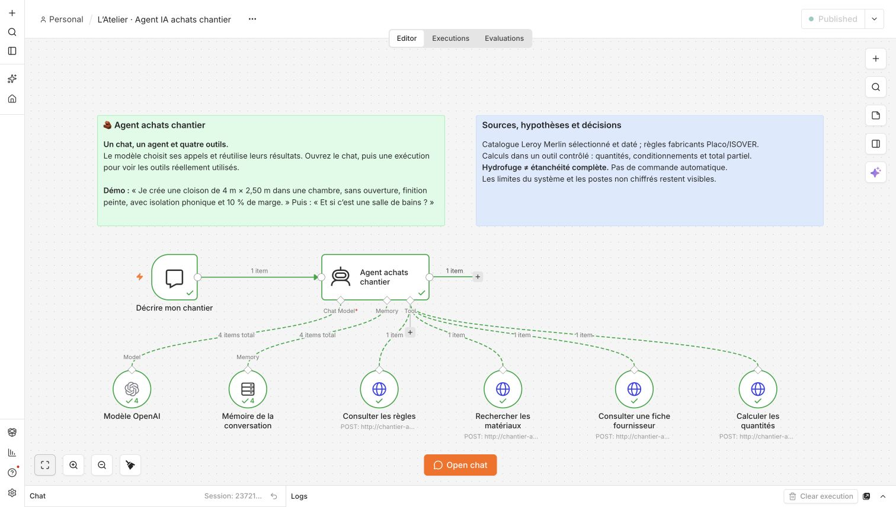
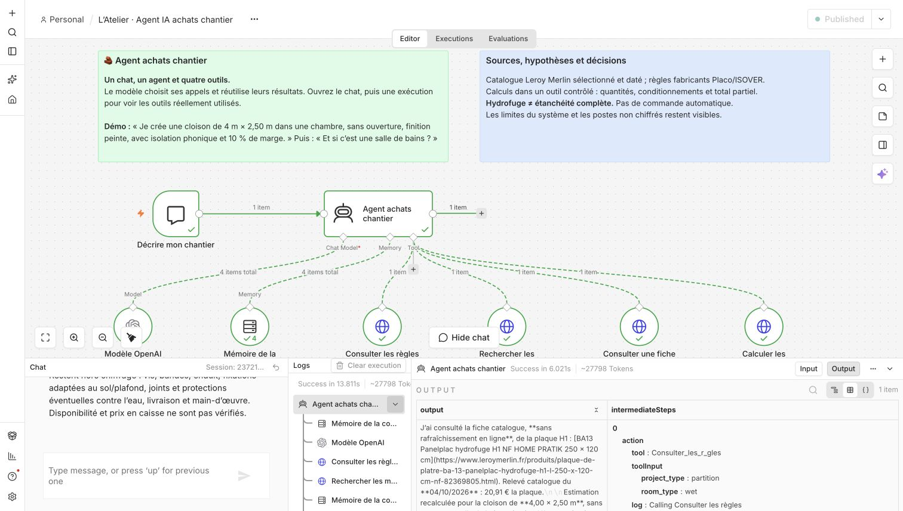

# Validation du 4 octobre 2026

La démonstration a été installée et publiée dans **n8n 2.39.8**, sous l’identifiant `atelierAgentChantier01`. Le nœud AI Agent appelle réellement le modèle OpenAI configuré et les outils HTTP du service `chantier-api`.

## Tests sans modèle

**27 tests réussis** avec `node --test chantier/test/*.test.mjs` : conditionnements, centimes, deux faces de cloison, une seule cavité isolante, ouvertures, règles d’humidité, champs contradictoires, limites des systèmes, erreurs HTTP et vérification bornée des fiches fournisseurs.

Les réponses fournisseur de ces tests sont contrôlées : elles vérifient le comportement du code, pas la disponibilité réelle de Leroy Merlin.

## Quatre tours réels avec OpenAI

| Exécution n8n | Demande fictive | Résultat observé | Durée côté test |
| --- | --- | --- | --- |
| 76 | « Je veux refaire une pièce en placo. » | Trois groupes de questions ; distinction cloison/doublage ; aucun appel au calculateur. | 5,236 s |
| 77 | Carreler 20 m² de salon, 10 % de marge, budget 350 € | Arcano : 21 cartons, couverture achetée 22,68 m², **247,17 €**. | 9,143 s |
| 78 | Cloison de chambre 4 × 2,50 m, sans ouverture, finition peinte, isolation, 10 %, budget 500 € | 8 plaques standard, 5 rails, 9 montants, 1 lot d’isolant ; **170,51 €**. | 14,808 s |
| 79 | Même session : salle de bains privative hors projections, budget 800 € | Dimensions et isolation conservées ; nouvelles règles humides et plaques H1 ; **272,27 €**. | 15,052 s |

Les traces sauvegardées montrent, pour chaque chiffrage : **règles → recherche catalogue → calculateur**. Les assertions vérifient les paramètres réellement transmis, les identifiants, les conditionnements, les prix des lots et les totaux retournés. Les quatre réponses ont également été relues : elles indiquent la date des prix, le périmètre du catalogue et les exclusions.

Le quatrième tour conserve la même session que le troisième. Il transmet `room_type: wet`, `room_usage: private_bathroom`, `water_exposure: outside_direct_spray`, le budget 800 et la référence H1. La réponse distingue le choix conservateur H1 sur deux faces d’une obligation universelle et précise que H1 ne remplace pas un système de protection à l’eau.

L’outil **Consulter une fiche fournisseur** n’a pas été choisi lors de ces quatre tours. Aucune vérification de prix en direct ne peut être déduite de cette campagne.

## Vérification dans le navigateur

Le scénario de la cloison sèche a aussi été saisi directement dans le chat de l’éditeur n8n. L’exécution manuelle a affiché **Success**, les trois appels d’outils et **170,51 €** dans la réponse, en 13,084 s selon n8n. Le modèle et la mémoire apparaissent plusieurs fois dans les journaux : ils sont utilisés à chaque étape de la boucle de l’agent.

## Portée des résultats

Ces essais prouvent les comportements observés sur ce petit corpus. Ils ne garantissent ni une réponse parfaite à toute demande, ni la conformité d’un ouvrage, ni un prix en caisse. Les prix restent ceux du relevé du 4 octobre 2026 ; aucun stock, achat ou paiement n’a été vérifié ou effectué.

Les quatre tours ont précédé un correctif ciblé qui refuse les champs d’humidité contradictoires et libère les réponses réseau inutilisées. Les 27 tests passent après ce correctif, puis le service a été redémarré. Le scénario manuel humide a ensuite réussi sur ce service mis à jour : **272,27 €**, en **13,811 s**, avec les quatre outils effectivement appelés, y compris la consultation de la fiche H1 avec `refresh:false`. Cette consultation ne revendique aucun prix en direct. Les preuves détaillées des tests restent localement dans le dossier ignoré `work/chantier-validation/`.

## Captures de l’éditeur

