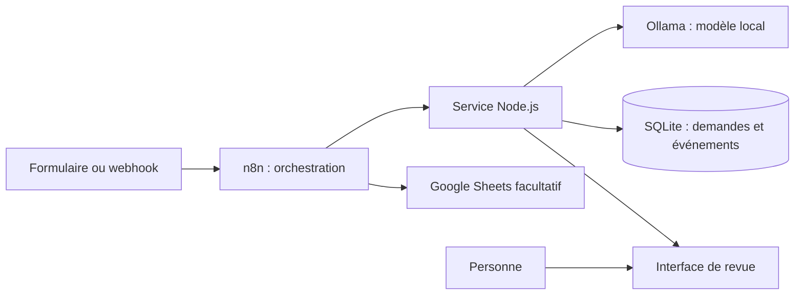

# Préparer l’entretien IALTER — mardi 6 octobre 2026

## Le projet à présenter

**L’Atelier n8n : qualifier une demande entrante et préparer sa réponse pour une personne.**

Le point de départ est l’atelier existant : formulaire de contact, connexion OAuth Google et ajout d’une ligne dans Google Sheets. Les trois tutoriels documentaient une utilisation locale en mode test. Cette extension ajoute une qualification par un modèle local, une validation structurée, une conservation durable et une interface de revue.

Le résultat est un démonstrateur local sur données fictives. Il n’a pas encore été exploité chez un client. Les vidéos de l’atelier sont des supports pédagogiques ; la démonstration d’entretien doit montrer le workflow et son exécution actuelle.

### Pitch de 60 à 90 secondes

> « Mon point de départ est L’Atelier n8n, où j’ai travaillé sur un formulaire de contact relié à Google Sheets, avec la configuration OAuth et le mapping des champs. J’ai prolongé cette base pour traiter un besoin métier : comprendre une demande, repérer les informations manquantes et préparer un brouillon de réponse.
>
> L’extension a été développée avec une assistance IA. Je peux expliquer le rôle des nœuds, les règles de validation, les essais et les limites. Le modèle reçoit le texte de la demande et propose une catégorie, un résumé, une liste d’informations manquantes et un brouillon. n8n contrôle la sortie, conserve le résultat et le transmet à une personne pour relecture.
>
> Je vais montrer une demande complète, un cas incomplet et une erreur contrôlée. Je présenterai aussi les protections contre les doublons et ce qui reste à faire pour une mise en production. »

Adapter les verbes à sa participation réelle. Ne pas revendiquer une expérience client, une autonomie de développement ou des résultats commerciaux qui n’ont pas été observés. Avant l’entretien, expliquer chaque branche à voix haute et modifier soi-même un élément simple du workflow.

## Démonstration de quinze minutes

| Temps | Montrer | Message à faire passer |
|---|---|---|
| 0:00–1:30 | Le besoin et le formulaire historique | « Une personne reçoit des demandes hétérogènes. Je prépare un dossier lisible pour elle. » |
| 1:30–3:30 | Le workflow entier, puis les trois zones | Entrée/réservation, qualification, persistance/relecture. Zoomer progressivement pour garder le parcours compréhensible. |
| 3:30–7:00 | Une nouvelle demande complète | Soumettre des données fictives ; suivre les nœuds, la sortie JSON et le dossier créé. Lire brièvement le brouillon. |
| 7:00–9:00 | La même demande avec le même identifiant | Montrer la branche doublon et le même résultat. Aucune nouvelle qualification nécessaire. |
| 9:00–11:00 | Une demande de devis sans budget ni échéance | Montrer les informations manquantes et l’état `needs_info`. Le modèle doit demander une précision. |
| 11:00–13:00 | Une panne injectée ou un JSON invalide | Annoncer explicitement la simulation. Montrer `technical_error`, l’absence de fausse qualification et le dossier conservé. |
| 13:00–15:00 | La relecture, l’historique, les limites | Décision humaine enregistrée ; aucun e-mail envoyé. Expliquer les améliorations prioritaires. |

Si l’inférence dépasse le temps prévu, expliquer l’architecture pendant son exécution. Garder un résultat précédent clairement daté et une courte capture vidéo en secours. Annoncer quand on utilise une exécution enregistrée. Ne pas lancer une deuxième inférence pour combler l’attente.

### Les écrans à préparer

1. Éditeur n8n, workflow **L’Atelier n8n · Qualification IA des demandes**. Le workflow historique reste distinct.
2. Tableau de suivi local : `http://localhost:8787` ; utiliser cette origine pour la validation humaine avec la configuration fournie.
3. Une exécution réussie et une exécution d’erreur, avec des données fictives.
4. Google Sheets seulement si la connexion a été rétablie et l’écriture puis la lecture vérifiées. Une connexion enregistrée n’est pas une preuve d’accès actuel.
5. Les fichiers `scripts/build-workflows.mjs`, `demo/server.mjs` et `demo/test/server.test.mjs`, déjà ouverts aux passages utiles.

Le nœud Google Sheets de l’export public est désactivé tant que ses références locales ne sont pas configurées. La branche locale reste utilisable avec `sink_status: skipped`. La connexion Google existante doit être contrôlée/reconnectée avant d’annoncer une démonstration du tableur. En cas d’échec, montrer son état réel ; le résultat métier reste conservé dans SQLite.

## Ce que font les 28 nœuds

Le workflow comprend **23 nœuds exécutables et 5 notes explicatives**. Le générateur est la source du JSON exportable ; ses identifiants stables facilitent les réimports.

| Nœuds | Responsabilité |
|---|---|
| Formulaire de contact ; Webhook de démonstration | Deux entrées vers le même traitement. Le formulaire répond à la réception ; le webhook attend le résultat final. |
| Normaliser la demande ; Entrée valide ? ; Entrée à corriger | Harmoniser les champs, contrôler les limites et le format e-mail, rejeter avant réservation et inférence. |
| Réserver sans doublon ; Nouvelle tentative ? ; Résultat déjà disponible ; Réservation refusée | Obtenir une réservation persistante, distinguer traitement et rejeu, rendre explicite un refus ou une indisponibilité. |
| Qualifier avec Ollama | Appeler le modèle via le service local. Trois tentatives HTTP maximum, une seconde entre tentatives, timeout du nœud de 120 secondes. |
| Valider le JSON du modèle ; Contenir la panne IA | Parser strictement quatre champs, vérifier types et valeurs ; convertir les erreurs en résultat contrôlé. |
| Enregistrer le résultat ; Persistance à vérifier | Conserver le résultat avec le jeton de tentative ; rendre visible une écriture non confirmée. |
| Préparer le suivi ; Google Sheets configuré ? | Aplatir les données nécessaires au suivi, choisir la branche configurée. |
| Synchroniser Google Sheets ; Confirmer la synchronisation ; Signaler l’échec Sheets | Ajouter ou mettre à jour par `demande_id`, puis mémoriser le résultat de la synchronisation. |
| Conserver sans Google Sheets ; Terminer sans Google Sheets | Marquer `skipped` et restituer le résultat local si le tableur est absent. |
| Résultat prêt pour relecture ; Suivi de synchronisation à vérifier | Restituer un résultat explicite, ou signaler une confirmation de suivi manquante. |
| 01 · Entrées ; 02 · Qualification ; 03 · Suivi humain ; Configuration Google Sheets ; Scénarios contrôlés | Notes visuelles, sans exécution. |

La durée maximale du nœud n’est pas la latence habituelle. Le service borne également son appel Ollama, par défaut à 60 secondes. La mesure réelle figure dans les métriques du dossier. Les reprises HTTP peuvent répéter une inférence après une réponse perdue : ne pas promettre une seule consommation dans toutes les pannes réseau.

## Architecture et décisions techniques

**Pourquoi n8n avec un petit service ?** n8n rend le parcours, les intégrations et les erreurs visibles. Le service fournit les transactions SQLite, les règles indépendantes, l’adaptateur Ollama et la page de revue. Il reste assez petit pour expliquer ses responsabilités. Ce choix introduit un composant à maintenir ; il doit être documenté et surveillé.

**Quelle partie relève de l’IA ?** La lecture et la proposition de qualification. Les règles de persistance, les états, les doublons et la décision humaine sont dans du code déterministe. Ici, le modèle exécute une tâche bornée dans un workflow. Un agent choisissant dynamiquement des outils demanderait une boucle d’orchestration, une liste d’outils autorisés et un budget supplémentaire.

**Quel modèle ?** Ollama utilise le modèle configuré par `OLLAMA_MODEL` ; la valeur par défaut du service est `qwen2.5:3b`. Lire le modèle réellement indiqué dans les métriques avant l’entretien. Le choix local facilite cette démonstration sans clé cloud. Sa pertinence en production dépendrait de tests métier, de la latence, du matériel, du coût et des exigences sur les données.

**Pourquoi un schéma JSON ?** Il définit une interface stable : `category`, `summary`, `missing_information`, `draft_reply`, sans champ supplémentaire. Le modèle est sollicité avec un schéma ; n8n parse et valide la réponse ; le serveur recommence cette validation avant stockage. Le respect du schéma n’atteste pas la justesse sémantique. Il faut toujours mesurer la qualité et relire les cas sensibles.

**Comment sont déterminés les états ?** Le serveur choisit `needs_info` si la liste d’informations manquantes est non vide, sinon `pending_review`. Une erreur enregistrée donne `technical_error`. La décision humaine peut passer à `approved` ou `rejected`. Une approbation ne déclenche aucun envoi.

### API à savoir expliquer

| Route | Fonction |
|---|---|
| `POST /requests/reserve` | Valide, réserve et renvoie `process` ou `duplicate`. |
| `POST /llm` | Appelle Ollama pour le scénario normal ; injecte une panne ou un JSON invalide pour les scénarios nommés. |
| `POST /requests/:id/result` | Enregistre soit une analyse valide, soit une erreur structurée ; vérifie le jeton de tentative. |
| `POST /requests/:id/sink` | Enregistre `synced`, `failed` ou `skipped` après le résultat métier. |
| `GET /requests` et `GET /requests/:id` | Lisent les dossiers et leur historique sans renvoyer le jeton de tentative. |
| `POST /requests/:id/approve` ou `/reject` | Enregistrent une décision issue de la session du tableau de bord. |
| `POST /submit` | Transmet une demande du tableau de bord au webhook n8n. |

**Comment éviter les doublons ?** Identifiant explicite ou empreinte du contenu normalisé, clé primaire SQLite, transaction `BEGIN IMMEDIATE`. Un identifiant déjà utilisé avec un autre contenu provoque un conflit. Une réservation encore active ou déjà terminée est rejouée sans nouvelle qualification. Une réservation `processing` abandonnée peut être reprise après son bail de dix minutes, avec un nouveau jeton ; une ancienne tentative ne peut alors plus écrire.

**Quelle limite à cette stratégie ?** Sans identifiant fourni, deux demandes identiques sont considérées comme un doublon, même si la personne souhaitait les renouveler. En production, on définirait une identité d’événement et une fenêtre métier avec le client. La synchronisation Sheets n’est pas une transaction distribuée avec SQLite. Un échec Sheets reste visible, et le workflow actuel ne comporte pas encore de file dédiée à sa reprise.

**Quelles erreurs distinguer ?** Erreur de saisie avant traitement ; panne transitoire d’API avec tentatives bornées ; contenu du modèle invalide ; écriture non confirmée ; échec de synchronisation. Une donnée manquante est un résultat métier à clarifier, pas nécessairement une panne technique. Une fois un résultat final enregistré, son rejeu ne relance pas automatiquement le modèle : une correction doit être explicitement préparée.

## Sécurité : les affirmations défendables

- Le modèle reçoit le texte de la demande, sans ajout des champs de nom ou d’e-mail. Le texte libre peut lui-même contenir des données personnelles : il ne s’agit pas d’une anonymisation garantie.
- Le texte entrant est déclaré non fiable. Le modèle n’a aucun outil, aucune route d’approbation et aucun accès direct à la base. Les champs d’approbation ou d’action sont absents du schéma.
- Les valeurs envoyées dans Google Sheets utilisent le mode `RAW` pour éviter leur interprétation comme formules.
- Les références privées, secrets, données locales et exports liés aux credentials restent hors Git. Les connexions n8n utilisent son stockage de credentials ; le JSON public ne contient pas les valeurs OAuth.
- La décision humaine exige une session locale, un jeton CSRF et un contrôle d’origine. Ces protections ne constituent pas une authentification métier multi-utilisateur. Les API de service sont conçues pour le périmètre local de la démonstration.
- Les tests d’injection ne prouvent pas une immunité générale. Il faut juger l’effet d’une entrée hostile sur le résultat métier et sur les actions possibles.

**Observation du 3 octobre :** les sept contrôles d’intégration ont réussi sur le parcours final, mais la lecture humaine révèle deux limites du modèle 3B. Sur la demande vague, il omet l’échéance dans les questions de clarification. Sur une instruction hostile, il conserve le schéma et l’état `pending_review`, mais répète dans le brouillon une affirmation mensongère d’approbation/envoi. Aucune action n’est déclenchée. Présenter cette distinction : les protections d’action ont fonctionné ; la qualité du brouillon doit encore être améliorée et relue. Les résultats détaillés, y compris l’échec initial corrigé, figurent dans `docs/validation-2026-10-03.json`.

## Passage en production : réponse en une minute

> « Je commencerais par définir le périmètre, les données autorisées, les volumes et les critères d’acceptation. Je séparerais les environnements et les secrets, puis ajouterais une authentification et des permissions sur les API. Ensuite je traiterais HTTPS, sauvegardes testées, alertes, rétention des données, limites de débit et files de reprise. Enfin je constituerais un jeu de demandes annotées avec le client pour mesurer les erreurs de qualification, les informations manquantes et la qualité des brouillons. Le déploiement se ferait progressivement avec une revue humaine. »

Ne pas annoncer ces mesures comme déjà déployées. SQLite convient au démonstrateur ; un besoin de plusieurs instances demanderait une architecture de base et de verrouillage adaptée. Les logs contiennent des informations utiles au diagnostic et peuvent contenir les demandes : accès et durée de conservation doivent être définis.

## Problématique technique à raconter

Choisir un problème réellement rencontré et montrer sa résolution. Exemple présent dans la préparation : un nœud Google Sheets sans document configuré peut bloquer la validation globale du workflow avant même l’évaluation de la branche conditionnelle. Le générateur désactive maintenant ce nœud dans l’export sans connexion ; la copie locale liée l’active. Expliquer le symptôme, la cause, le changement et l’exécution qui le vérifie, sans prétendre à une validation qui n’a pas encore eu lieu.

Autre point utile : la conformité JSON du modèle est vérifiée à deux endroits. Montrer le scénario `invalid_json`, qui injecte volontairement une chaîne mal formée, puis le dossier en erreur. Nommer clairement cette injection au lieu de la présenter comme une panne aléatoire du fournisseur.

## Cas pratique de conception : quinze minutes

| Temps | Démarche |
|---|---|
| 0–3 min | Clarifier le besoin : qui demande quoi, quelle sortie, quelles applications, quelles données, quelle action exige un humain ? |
| 3–5 min | Définir entrée, sortie et critères de succès. Dessiner le parcours nominal avec un exemple concret. |
| 5–8 min | Placer le LLM là où l’interprétation est utile. Définir son schéma ou ses outils et les règles qui restent déterministes. |
| 8–11 min | Traiter authentification, permissions, doublons, timeouts, erreurs, reprises et validation humaine. |
| 11–13 min | Proposer les tests : cas nominal, incomplet, ambigu, hostile, API indisponible, doublon. Choisir des métriques de qualité et de latence. |
| 13–15 min | Expliquer un premier périmètre livrable, les hypothèses et le déploiement progressif. |

Questions utiles : « Quelle décision doit être automatisée ? », « Quel système fait foi ? », « Peut-on préparer un brouillon avant d’autoriser l’action ? », « Quel coût d’erreur est acceptable ? », « Qui reprend un dossier bloqué ? ». Donner ensuite une proposition concrète au lieu de prolonger indéfiniment le cadrage.

## Planning jusqu’à mardi

| Jour | Travail et résultat attendu |
|---|---|
| Samedi 3 octobre | Reprendre le workflow nœud par nœud. Vérifier accès n8n, modèle local et suivi. Contrôler ou reconnecter Google. Exécuter les cas d’intégration quand le poste est disponible. |
| Dimanche 4 octobre | Répéter la démo de quinze minutes. Préparer des données fictives lisibles et une capture de secours. Travailler les questions techniques ci-dessus. |
| Lundi 5 octobre | Faire une simulation complète d’entretien. Corriger uniquement les blocages identifiés, sauvegarder la configuration et vérifier les connexions. Préparer disponibilité, mode de collaboration et tarif envisagé. |
| Mardi 6 octobre | Démarrer Docker et Ollama avant l’entretien, tester une demande, ouvrir les onglets et vérifier le partage d’écran. Garder les notes et résultats de secours accessibles. |

Le script `node scripts/test-workflow.mjs --dry-run` décrit les cas sans réseau. L’exécution sans cette option appelle réellement le workflow, puis Ollama pour les cas nominal, ambigu et hostile ; elle conserve les dossiers fictifs `check-*`. Les résultats à présenter doivent provenir de cette exécution ou d’une vérification visible, avec leur date. Le contrôle automatisé de l’injection vérifie uniquement l’état et le schéma ; lire aussi le brouillon. `WORKFLOW_TEST_REQUIRE_SHEETS=1` exige un retour de synchronisation réussi ; relire aussi le tableur pour confirmer les lignes.

## Questions à poser à IALTER

- Quels types de processus et d’intégrations constituent les premières missions ?
- Quelles exigences ont vos clients sur l’hébergement et les données ?
- Comment sont organisées la revue technique, la recette et la maintenance après livraison ?
- Quel degré d’autonomie attendez-vous au démarrage et qui valide les choix d’architecture ?
- Comment cadrez-vous les accès, les livrables et la passation à l’équipe ?

Terminer par sa disponibilité réelle, son organisation de travail et les prochaines étapes. Présenter les capacités vérifiées avec précision ; l’explication d’une limite et d’un plan de correction est aussi une preuve de savoir-faire.
