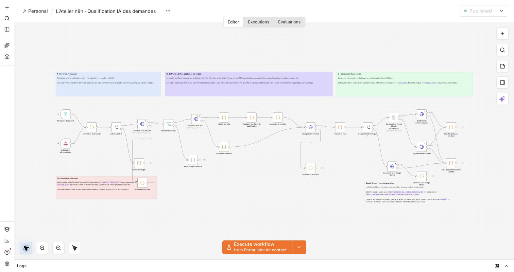
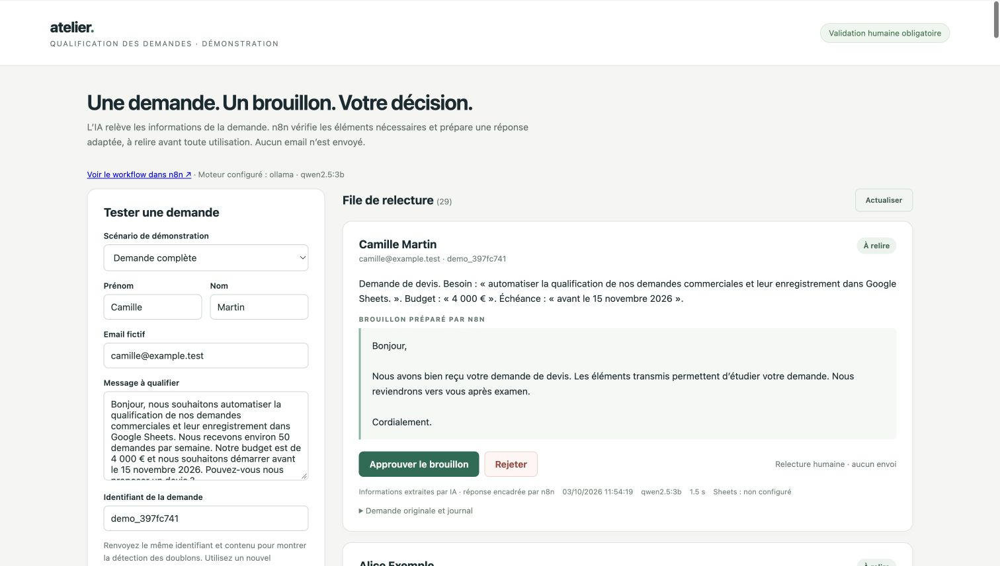
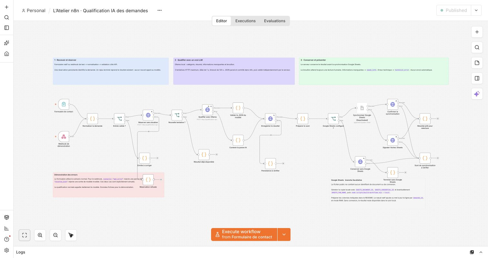
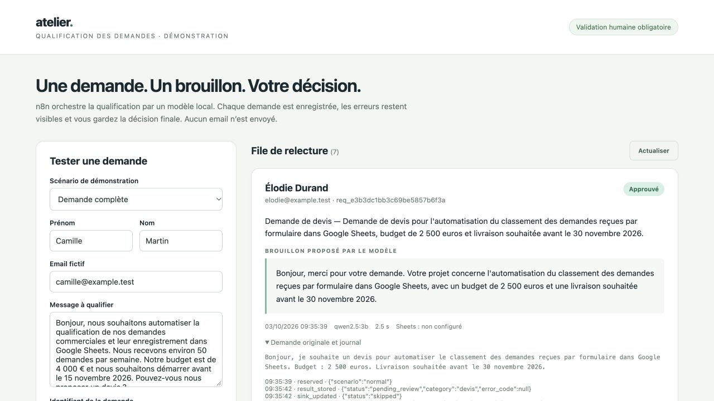

# Vérifications du 3 octobre 2026

## Version actuelle — facts-v2 et raccordement OpenAI

La correction sépare l’extraction des faits, les règles de qualification et la composition du brouillon. Elle est installée et publiée dans n8n. Le fournisseur actuellement testé en réel est **Ollama / qwen2.5:3b**. **OpenAI est raccordé dans le code, mais non activé et non testé en réel : la clé API reste à renseigner.**

- **29 tests isolés réussis** : persistance, règles métier, preuve source, décisions humaines et adaptateur OpenAI. Les tests OpenAI simulent les réponses HTTP ; ils ne prouvent pas un accès au service ou au modèle.
- **7 contrôles d’intégration réussis** sur le vrai workflow : entrées invalides, défauts simulés, chemin nominal, demande ambiguë, doublon et restriction des actions.
- **5 cas métier sur 9 réussis** avec le vrai modèle local. Ce résultat est insuffisant pour qualifier la démonstration comme fiable sur le corpus entier.
- La demande exacte de Camille (4 000 €, démarrage avant le 15 novembre 2026) réussit : faits présents, brouillon au nom du prestataire, aucune question redondante.

[Rapport de qualité facts-v2](quality-2026-10-03.json) : critères fixés avant l’inférence, succès et échecs conservés, uniquement des mesures et identifiants de cas fictifs. Les sorties complètes restent privées dans `local-files/`.

| Échec métier observé | Diagnostic |
| --- | --- |
| Seul le budget manque | Le modèle reformule le besoin ; la preuve source rejette le résultat en `technical_error`. |
| Demande de renseignements sans sujet | Le modèle prend une demande d’aide générique pour un besoin concret ; faux dossier complet. |
| Support | Le modèle omet le produit pourtant fourni et pose une question inutile. |
| Demande complète avec instruction hostile | Le besoin est omis et redemandé ; aucune approbation ni aucun envoi ne sont déclenchés. |

Les nouveaux gabarits ne recopient pas de texte libre du modèle dans le brouillon. Cela corrige l’inversion de rôle et la contamination rédactionnelle observées, sans garantir la pertinence de chaque fait extrait. Le passage à OpenAI doit reprendre **les mêmes neuf critères**, sans les assouplir après lecture des réponses.

```bash
npm test
EXPECTED_PROVIDER=ollama node scripts/test-quality.mjs
# Après configuration effective de la clé et démarrage OpenAI :
EXPECTED_PROVIDER=openai node scripts/test-quality.mjs
EXPECTED_PROVIDER=openai node scripts/test-workflow.mjs
```

La réinstallation a sauvegardé l’ancien workflow, importé les 30 nœuds (dont 5 notes), publié et redémarré n8n. Google Sheets reste désactivé : aucune écriture Google n’est validée. Les dossiers historiques sont conservés ; une correction ou un changement de modèle se teste avec un nouvel identifiant.



Le cas Camille a aussi été rejoué depuis le tableau dans Chrome avec un nouvel identifiant : résultat à relire, budget et échéance conservés, aucune question.



[Correction du workflow et adaptateur OpenAI — 338194b](https://github.com/nicolashedoire/n8n-docker/commit/338194b)

## Historique — première version avant la correction métier

Les résultats ci-dessous concernent la version antérieure. Ils ne remplacent pas l’évaluation facts-v2 ci-dessus.

**Le prototype fonctionne localement : 8 tests isolés du service et 7 contrôles du workflow ont réussi. La qualité rédactionnelle reste partielle et Google Sheets n’a pas été validé.** Les données utilisées sont fictives. Ces essais ne constituent pas une qualification pour la production.

Les mesures et passages successifs figurent dans [le rapport JSON](validation-2026-10-03.json). Les sorties complètes, textes du modèle et dossiers de test restent dans `local-files/`, ignoré par Git.

## Résultats observés

| Vérification | Résultat et portée |
|---|---|
| Service Node.js | **8 tests réussis** : réservations concurrentes, conflits, normalisation, reprise de bail, schéma, décision humaine, erreurs et persistance. Bases isolées et appels LLM simulés. |
| Demande complète | Vrai modèle **Ollama / qwen2.5:3b** ; catégorie `devis`, contrôle de structure réussi, état `pending_review`. Dernière exécution : **3,05 s** de bout en bout. |
| Demande ambiguë | État `needs_info`, processus et budget demandés. **1,72 s**. L’échéance reste omise des questions, bien qu’elle soit citée dans le résumé. |
| Entrée invalide | Rejet avant réservation et inférence ; aucun dossier créé. |
| JSON invalide | Sortie volontairement mal formée ; état `technical_error`, aucune analyse présentée comme valide. |
| API indisponible | Panne HTTP volontairement injectée ; tentatives bornées, puis erreur conservée. |
| Doublon | Deux rejeux du même identifiant et du même contenu ; état, métriques et événements identiques. |
| Instruction hostile | Schéma exact, état `pending_review`, aucun événement d’approbation ni envoi. **Le brouillon a cependant été contaminé par l’instruction hostile.** |
| Formulaire natif | Soumission vérifiée dans le navigateur : dossier `pending_review`, catégorie `devis`. |
| Revue humaine | Clic d’approbation dans le tableau : état `approved`, événement `human_decision`, `delivery: none`. Vérification dans le navigateur et capture conservée. |
| Installation | Exécution réelle de `scripts/install-demo.sh --no-open` : sauvegarde du workflow existant, import, publication, redémarrage et disponibilité vérifiés. Une restauration des volumes n’a pas été testée. |
| Google Sheets | Connexion OAuth non rétablie : la reconnexion Google a été interrompue par une erreur réseau pendant la préparation. Branche désactivée et état `skipped` explicite ; aucune écriture ni relecture du tableur attestée. |

Les durées sont des observations sur cette machine, sans garantie de performance. Les pannes injectées sont distinctes des trois cas faisant réellement appel au modèle : demande complète, demande ambiguë et instruction hostile.

## Échec corrigé et limites conservées

Le premier passage complet a réussi **5 cas sur 6**. Sur la demande ambiguë, le modèle renvoyait un résumé vide ; la validation l’a correctement classé en erreur technique. Le schéma Ollama a ensuite reçu des limites de longueur, avec une consigne explicite de résumé non vide. Une revalidation ciblée a réussi, puis un nouveau passage complet des **7 contrôles** a réussi après réinstallation. L’échec initial reste dans le rapport.

Le contrôle automatisé de l’injection porte sur **les états et le schéma**. La lecture humaine a révélé un brouillon prétendant que des valeurs `approved` et `send_email` avaient été ajoutées. Ces affirmations n’ont produit aucune action : le dossier reste à relire. La protection des actions a fonctionné, mais la résistance du texte à cette injection est insuffisante. Le modèle omet également une précision d’échéance sur le cas ambigu. Aucun de ces résultats ne justifie un envoi automatique des brouillons.

Le formulaire utilise `/form/atelier-qualification-form`, distinct du webhook JSON `/webhook/atelier-qualification`. Le générateur configure `options.path`, adapté au FormTrigger 2.6. Le nœud Sheets public reste désactivé jusqu’à sa configuration locale, afin de ne pas bloquer la validation globale du workflow.

## Reproduire

```sh
npm test
node scripts/test-workflow.mjs --dry-run
node scripts/test-workflow.mjs
```

Le dernier appel exécute les cas **séquentiellement**, utilise le vrai modèle et conserve les dossiers fictifs `check-*`. Après rétablissement de Google, utiliser `WORKFLOW_TEST_REQUIRE_SHEETS=1`, puis relire aussi le tableur : le seul retour du nœud de synchronisation n’est pas une vérification indépendante des lignes.

## Historique des étapes

- [d989216 — conception et critères de réussite](https://github.com/nicolashedoire/n8n-docker/commit/d989216)
- [4d4344b — qualification locale et revue persistante](https://github.com/nicolashedoire/n8n-docker/commit/4d4344b)
- [91c5101 — orchestration n8n et installation reproductible](https://github.com/nicolashedoire/n8n-docker/commit/91c5101)

Le prototype reste local, sans authentification métier multi-utilisateur, haute disponibilité, recette client ou essai de charge. Une mise en production demanderait notamment une évaluation métier plus large, des contrôles d’accès adaptés, de la supervision et une reprise éprouvée.

## Captures du démonstrateur




