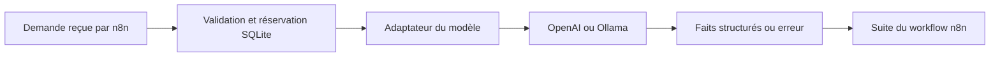

# 05 — Le service API et le fournisseur de modèle

Ce chapitre explique le code de la démonstration **facts-v2**, depuis la validation des entrées jusqu’à l’appel du fournisseur et à la gestion de ses erreurs. Il s’adresse à une personne à l’aise avec n8n qui souhaite comprendre les mécanismes JavaScript derrière le workflow.

Dans facts-v2, le modèle extrait des faits. Des règles déterministes qualifient ensuite la demande et composent le brouillon. Ce chapitre couvre les sections 1 à 8 du support backend ; le [chapitre suivant](https://github.com/nicolashedoire/n8n-docker/blob/main/docs/tutoriel/06-persistance-relecture-tests.md) reprend l’enregistrement, la relecture et les tests. Chaque chapitre peut se lire séparément.

## Sources et nature des exemples

Sources du code relu le 3 octobre 2026 : [serveur HTTP et SQLite](https://github.com/nicolashedoire/n8n-docker/blob/main/demo/server.mjs), [adaptateur OpenAI et Ollama](https://github.com/nicolashedoire/n8n-docker/blob/main/demo/llm-provider.mjs), [politique facts-v2](https://github.com/nicolashedoire/n8n-docker/blob/main/demo/qualification-policy.mjs).

Les blocs JavaScript sont des extraits du code, parfois réindentés pour la lecture. Les objets JSON sont des exemples de contrat, raccourcis lorsque cela est précisé ; ils ne représentent pas de nouveaux résultats obtenus auprès du modèle. Les diagrammes Mermaid illustrent le fonctionnement. **Aucune image de ce chapitre n’est une capture d’écran d’exécution** : ce chapitre contient du texte, des extraits et un schéma explicatif. Les captures de l’interface utilisées dans le tutoriel vidéo constituent des éléments distincts.



## 1. Pourquoi ajouter un petit service à n8n ?

n8n organise l’exécution : réception de la demande, appels, branchements, qualification et synchronisation. Le service conserve l’état durable de chaque demande, donne accès au modèle configuré et vérifie ce qui peut être enregistré. Si une exécution recommence ou si la synchronisation échoue, on peut retrouver une demande et comprendre son parcours.

Le projet répartit ces responsabilités dans trois fichiers :

| Fichier | Question à laquelle il répond |
| --- | --- |
| `demo/server.mjs` | Qui peut enregistrer quoi ? Quel est l’état de chaque demande ? |
| `demo/llm-provider.mjs` | Comment appeler OpenAI ou Ollama et interpréter leur réponse ? |
| `demo/qualification-policy.mjs` | Quels faits sont acceptables, quelles informations manquent et quel brouillon produire ? |

Le suffixe `.mjs` indique un module JavaScript. `export` rend une fonction réutilisable depuis un autre fichier ; `import` la récupère. Le service utilise les modules intégrés à Node.js pour HTTP, SQLite, les fichiers et la cryptographie. Il n’a pas besoin d’un framework HTTP ou d’un paquet externe pour ces fonctions.

La fonction principale s’appelle `createDemoServer(options)`. Elle construit le serveur et ses dépendances. Le démarrage réseau est placé tout en bas du fichier et se produit seulement quand on lance directement ce fichier. Un test peut donc importer le serveur sans démarrer automatiquement une instance de démonstration.

La chaîne générale est la suivante :

```text
demande → réservation SQLite → extraction par le modèle
        → qualification déterministe dans n8n
        → vérification indépendante par le service
        → résultat SQLite → synchronisation éventuelle
        → décision de relecture enregistrée
```

## 2. Lire une entrée : validation et normalisation

Une demande entrante ressemble à ceci :

```json
{
  "request_id": "demo-devis-001",
  "first_name": "Camille",
  "last_name": "Martin",
  "email": "camille@example.test",
  "message": "Je souhaite un devis pour extraire les montants de nos factures PDF. Budget : 4 000 €. Livraison avant le 15 novembre 2026.",
  "scenario": "normal"
}
```

`readBody(req)` intervient avant le traitement d’une requête POST. Cette fonction exige un corps JSON, limite sa taille à 65 536 octets puis le transforme en objet JavaScript avec `JSON.parse`. Une liste JSON, un nombre ou du texte seul ne suffisent pas : l’entrée doit être un objet.

Les limites de transport et les limites des champs sont différentes. Le transport borne la taille totale en octets. `normalizeRequest` borne ensuite les chaînes : 100 caractères pour chaque nom, 254 pour l’email et 10 000 pour le message. Techniquement, JavaScript utilise ici la longueur de la chaîne ; certains caractères représentés par plusieurs unités, notamment des émojis, comptent davantage qu’un caractère visuel.

La petite fonction `text` évite de répéter le même contrôle dans plusieurs routes :

```js
const text = (value, field, max, optional = false) => {
  if (optional && (value === undefined || value === '')) return '';
  if (typeof value !== 'string' || !value.trim() || value.length > max)
    fail(400, 'invalid_input', `${field} : texte requis, maximum ${max} caractères.`);
  return value.trim();
};
```

Cet extrait est présenté avec un retour à la ligne supplémentaire pour la lecture. `typeof` contrôle le type ; `trim()` retire les espaces au début et à la fin ; `fail` lève une erreur qui interrompt le traitement. Une valeur absente ne devient donc pas silencieusement la chaîne « undefined ».

`normalizeRequest` construit un nouvel objet avec les seuls champs attendus. L’email passe en minuscules. Les espaces extérieurs des textes sont retirés. Le scénario prend la valeur `normal` s’il est absent : c’est le rôle de l’opérateur `??`, qui choisit une valeur de secours quand la valeur de gauche est absente ou nulle.

Deux limites méritent d’être comprises : la vérification d’email contrôle une forme simple, sans vérifier l’existence de la boîte ; la normalisation ne réécrit pas le message. Deux messages qui veulent dire la même chose avec des formulations différentes restent deux contenus différents.

## 3. Identifiant et empreinte : reconnaître une répétition

La fonction `hash` calcule une empreinte SHA-256 du contenu normalisé :

```js
const hash = value => createHash('sha256')
  .update(JSON.stringify(value)).digest('hex');
```

`JSON.stringify` transforme l’objet en texte. Le serveur construit toujours son objet `payload` dans le même ordre, ce qui rend cette représentation stable pour un même contenu normalisé. L’empreinte couvre le prénom, le nom, l’email, le message et le scénario. Elle ne couvre pas `request_id`.

Si aucun identifiant n’est fourni, le service le dérive du contenu : préfixe `req_`, suivi des 24 premiers caractères hexadécimaux de l’empreinte. Si l’appelant fournit un identifiant, celui-ci doit contenir uniquement des lettres ASCII, des chiffres, des tirets ou des underscores, sur au plus 100 caractères.

Cela donne deux contrôles complémentaires :

- Même identifiant et même contenu : le service reconnaît une répétition.
- Même identifiant et contenu différent : il renvoie `409 id_conflict` et conserve la demande d’origine.

La déduplication est associée à l’identifiant. Fournir deux identifiants différents pour le même contenu crée deux demandes. L’empreinte n’est donc pas une contrainte globale d’unicité sur tous les messages.

Le mot « idempotence » désigne ici la capacité à recevoir une répétition sans créer une deuxième demande ou remplacer son résultat. C’est utile lorsque n8n relance un appel après une interruption réseau : l’appel précédent a peut-être déjà réussi, même si sa réponse n’a pas été reçue.

L’empreinte ne chiffre pas les données. Le contenu complet reste stocké en JSON dans SQLite. Elle sert à comparer des contenus ; elle ne constitue pas une anonymisation des informations clients.

## 4. SQLite : conserver la demande et son histoire

`createDemoServer` ouvre un fichier SQLite avec `DatabaseSync`. Le chemin peut être fourni par option, par `DATABASE_PATH`, par `DEMO_DB_PATH`, ou prendre la valeur locale prévue dans le code. Les tests peuvent utiliser `:memory:` pour créer une base temporaire en mémoire.

Deux tables sont créées si elles n’existent pas :

| Table | Contenu |
| --- | --- |
| `requests` | État courant : entrée, empreinte, statut, tentative propriétaire, résultat, erreur, métriques et synchronisation. |
| `events` | Historique des actions enregistrées : réservation, reprise, résultat, synchronisation et décision de relecture. |

La colonne `id` de `requests` est une clé primaire. La base ne peut donc pas conserver deux lignes ayant le même identifiant. Les champs `payload`, `analysis`, `error`, `metrics` et `details` contiennent du JSON sérialisé en texte ; le service les reconvertit en objets lorsqu’il prépare une réponse.

Les valeurs passent dans des requêtes préparées :

```js
const getRow = id => db.prepare(
  'SELECT * FROM requests WHERE id = ?'
).get(id);
```

Le point d’interrogation est un emplacement pour une valeur, pas une concaténation de texte SQL. Un message client contenant des apostrophes ou des mots ressemblant à du SQL reste une donnée.

Deux réglages complètent l’ouverture de la base. `journal_mode=WAL` utilise le journal de SQLite pour gérer les écritures. `busy_timeout=5000` permet d’attendre jusqu’à cinq secondes en cas de verrouillage. Ce sont des mécanismes locaux de base de données ; ils ne remplacent pas une stratégie de sauvegarde.

Pour regrouper une modification et son événement, le code utilise une transaction :

```js
const transaction = callback => {
  db.exec('BEGIN IMMEDIATE');
  try { const result = callback(); db.exec('COMMIT'); return result; }
  catch (error) { db.exec('ROLLBACK'); throw error; }
};
```

`BEGIN IMMEDIATE` prend un verrou d’écriture avant de lire et modifier les lignes concernées. `COMMIT` valide l’ensemble ; `ROLLBACK` annule l’ensemble en cas d’erreur. Une réservation et son événement sont ainsi enregistrés ensemble. Les appels au modèle ont lieu en dehors de ces transactions : on ne garde pas un verrou SQLite pendant une attente réseau.

Cette base et ces transactions rendent la réservation durable et atomique. Elles ne rendent pas atomiques toutes les actions extérieures, par exemple une écriture dans Google Sheets. C’est précisément la raison de conserver séparément l’état de synchronisation.

## 5. Réserver le travail : doublons, bail et jeton de tentative

`POST /requests/reserve` est la porte d’entrée du traitement durable. Il renvoie l’une de ces deux routes :

```json
{
  "route": "process",
  "request_id": "demo-devis-001",
  "attempt_token": "JETON_DE_TENTATIVE_FICTIF",
  "record": { "status": "processing" }
}
```

ou :

```json
{
  "route": "duplicate",
  "request_id": "demo-devis-001",
  "record": { "status": "pending_review" }
}
```

Ces exemples raccourcissent volontairement `record`. Une réponse réelle contient aussi l’entrée, les métriques et les événements. Le jeton fictif ci-dessus ne doit pas être utilisé : un vrai jeton est généré aléatoirement par le service.

Pour une demande nouvelle, le serveur crée une ligne `processing`, un jeton et une échéance de réservation dix minutes plus tard. Pour une demande déjà présente :

1. Il refuse un contenu différent sous le même identifiant.
2. Il renvoie `duplicate` si la demande est déjà terminée, ou si elle est encore réservée dans son délai.
3. Si elle est toujours `processing` après ce délai, il permet une reprise avec un nouveau jeton et un événement `lease_reclaimed`.

Le bail de dix minutes permet de reprendre un traitement abandonné. Il n’existe pas de tâche qui relance automatiquement les demandes expirées : une nouvelle réservation doit arriver. Le bail ne s’allonge pas automatiquement pendant le traitement.

Le jeton joue le rôle d’un droit d’écriture pour une tentative précise. `/result` et `/sink` doivent le présenter. Si un ancien traitement se réveille après la reprise par un autre, son ancien jeton est rejeté avec `409 stale_attempt`.

Nuance essentielle : le contrôle d’écriture compare le jeton, pas l’heure de fin du bail. Après dix minutes, l’ancien jeton reste utilisable tant qu’aucune nouvelle tentative ne l’a remplacé. Une reprise change le propriétaire ; le simple passage du temps ne l’invalide pas à lui seul.

Le service évite ainsi deux résultats concurrents qui s’écrasent. Il ne peut pas annuler rétroactivement un appel LLM déjà lancé. Si deux traitements se chevauchent après une reprise, les deux peuvent consommer un appel, même si un seul résultat sera accepté.

## 6. `/llm` : une extraction encadrée, sans action métier

La route reçoit `message` et `scenario`. Elle n’envoie pas automatiquement les champs séparés de prénom, nom ou email au modèle. Toutefois, si le message contient lui-même une identité ou une information confidentielle, celle-ci fait partie du texte transmis : aucun masquage automatique n’est implémenté.

Le modèle doit produire exactement cette forme :

```json
{
  "category": "devis",
  "facts": {
    "need": "Je souhaite un devis pour extraire les montants de nos factures PDF.",
    "budget": "4 000 €",
    "deadline": "avant le 15 novembre 2026",
    "availability": "",
    "product": "",
    "problem": ""
  }
}
```

La catégorie appartient à une liste fermée : `devis`, `rendez_vous`, `support`, `autre`. Les six champs factuels doivent tous exister. Chaque valeur est une chaîne de 300 caractères au maximum. Une information absente se représente par la chaîne vide `""`, pas par « inconnu », `null` ou une information inventée.

Le schéma interdit les propriétés supplémentaires. Un champ `send_email`, `approved` ou `tool_call` n’est pas une extension reconnue. Le prompt demande des extraits continus du message, explicite les différences entre échéance de projet et disponibilité de rendez-vous, et donne quatre exemples de classification et d’extraction.

Le message client est présenté comme une donnée non fiable. L’instruction système demande d’ignorer les tentatives de modifier le rôle ou d’approuver une demande. Cette consigne aide le modèle ; les validations et la séparation des actions apportent des contrôles supplémentaires. Aucun outil d’envoi ou d’approbation n’est fourni au modèle.

Deux scénarios permettent de montrer les chemins d’erreur sans dépendre d’une panne réelle :

| Scénario | Comportement exact |
| --- | --- |
| `normal` | Appel du fournisseur configuré. |
| `api_error` | Réponse HTTP 503 avec `injected_api_error`, sans appel au modèle. |
| `invalid_json` | Réponse HTTP 200 contenant volontairement un texte JSON tronqué, sans appel au modèle. |

Les deux derniers portent `provider: fault_injection` dans les métriques. Ils servent à tester une panne et un parseur ; ils ne prouvent pas la qualité d’une réponse réelle du modèle.

## 7. L’adaptateur OpenAI / Ollama

`createLlmProvider` expose deux fonctions : `metadata()` décrit la configuration ; `generate({messages, schema})` réalise un appel et renvoie `{text, metrics}`. L’API métier utilise ainsi un contrat stable quel que soit le fournisseur choisi.

`LLM_PROVIDER` doit être `ollama` ou `openai`. Sans configuration explicite, la valeur par défaut du code est `ollama`. La présence d’une clé ne change pas automatiquement le fournisseur. Le modèle est configurable : les valeurs par défaut présentes dans ce code sont `qwen2.5:3b` pour Ollama et `gpt-5.6-terra` pour OpenAI. Il s’agit de la configuration du projet, pas d’une promesse d’accès à un modèle pour tous les comptes.

### La clé reste dans la couche serveur

Pour OpenAI, le service privilégie un fichier de secret : chemin explicite `OPENAI_API_KEY_FILE`, sinon `/run/secrets/openai_api_key`. Si le fichier standard n’existe pas, il peut utiliser `OPENAI_API_KEY`. Un chemin explicitement configuré mais illisible provoque une erreur ; il ne déclenche pas un changement silencieux de clé.

La clé est lue pour construire l’en-tête HTTP `Authorization`. Elle n’est pas insérée dans les messages du modèle, dans les métriques ou dans les objets `record`. Les métadonnées exposent seulement `key_configured`, un booléen indiquant qu’une valeur locale exploitable a été trouvée. Cela ne vérifie pas sa validité auprès d’OpenAI.

### Ce que contient l’appel OpenAI

Le code utilise l’API Responses, à l’adresse fixe `https://api.openai.com/v1/responses`, avec :

```js
body = {
  model,
  input: messages,
  store: false,
  reasoning: { effort: 'low' },
  max_output_tokens: 2000,
  text: { format: {
    type: 'json_schema', name: 'qualification_facts', strict: true, schema
  } }
};
```

Cette présentation réindente l’objet existant. Le schéma contraint la structure demandée ; les 2 000 tokens bornent la sortie demandée ; `store: false` demande de ne pas stocker la réponse selon cette option de l’API. Ce dernier paramètre ne doit pas être présenté comme une garantie générale d’absence de toute conservation côté fournisseur.

Avec Ollama, l’adaptateur utilise `/api/chat`, le même schéma dans `format`, `stream: false`, une température de zéro, un contexte de 4 096 et une sortie bornée par `num_predict: 500`. Les options ne sont pas identiques entre fournisseurs ; le contrat de retour du service, lui, reste le même.

### Lire correctement la réponse

Une réponse Responses peut contenir plusieurs types d’éléments. `openaiText` recherche donc les éléments `message`, puis leurs contenus `output_text`. Il ne suppose pas que le premier élément de `output` contient forcément le texte utile.

La fonction refuse une réponse de refus, un résultat incomplet, un état différent de `completed`, un texte vide et un texte qui n’est pas un objet JSON valide. Un résultat incomplet est refusé même si la portion de texte reçue ressemble déjà à un JSON valide.

Pour Ollama, l’adaptateur vérifie l’enveloppe et la présence de `message.content`. La validation JSON complète se poursuit dans le workflow. Pour OpenAI, la syntaxe JSON est déjà contrôlée dans l’adaptateur. Dans les deux cas, la validation des faits et la validation avant stockage restent nécessaires.

## 8. Temps d’attente, erreurs et métriques

Un appel de l’adaptateur est limité à 60 secondes par défaut. L’option de test ou de configuration interne correspondante est bornée entre une milliseconde et 120 secondes. Le code ne réessaie pas tout seul : la politique de nouvelles tentatives appartient à n8n. Cela évite de multiplier involontairement les essais à chaque couche.

`LlmProviderError` transporte un statut HTTP, un code stable, un message compréhensible et des métriques. Quelques exemples :

| Situation | Code du service | Réponse HTTP du service |
| --- | --- | --- |
| Clé absente ou inaccessible | `openai_key_missing` ou code de fichier associé | 503 |
| OpenAI renvoie 401 | `openai_auth_error` | 502 |
| OpenAI renvoie 429 | `openai_rate_limited` | 503 |
| Réponse incomplète | `llm_incomplete` | 502 |
| Refus du modèle OpenAI | `llm_refused` | 422 |
| Délai de l’appel dépassé | `llm_timeout` | 502 |

Le service ne recopie pas le corps brut d’une erreur fournisseur. Ce corps pourrait contenir des données du message ou des détails sensibles. Le statut du service représente son échec d’intermédiation ; il peut donc être différent du statut renvoyé par le fournisseur.

Il faut également distinguer le HTTP du statut métier. Une réponse HTTP 200 peut porter un doublon correctement reconnu. Une demande peut être enregistrée durablement avec `status: technical_error`. La requête d’enregistrement a alors réussi, même si le traitement métier a échoué.

`cleanMetrics` conserve uniquement une liste de champs autorisés. Les compteurs doivent être des nombres finis et positifs ou nuls. Les chaînes sont limitées en longueur. On peut conserver le fournisseur, le modèle, la durée, les tokens, le nombre de tentatives et la version de qualification, sans stocker arbitrairement toute l’enveloppe fournisseur.

La durée de l’adaptateur mesure un appel. Les tokens proviennent de la réponse fournisseur de cet appel. Ces données ne calculent ni une facture en euros, ni nécessairement le total de toutes les tentatives du workflow. Les étiquettes reçues lors d’un enregistrement restent des métadonnées opérationnelles, pas une preuve cryptographique du fournisseur utilisé.
