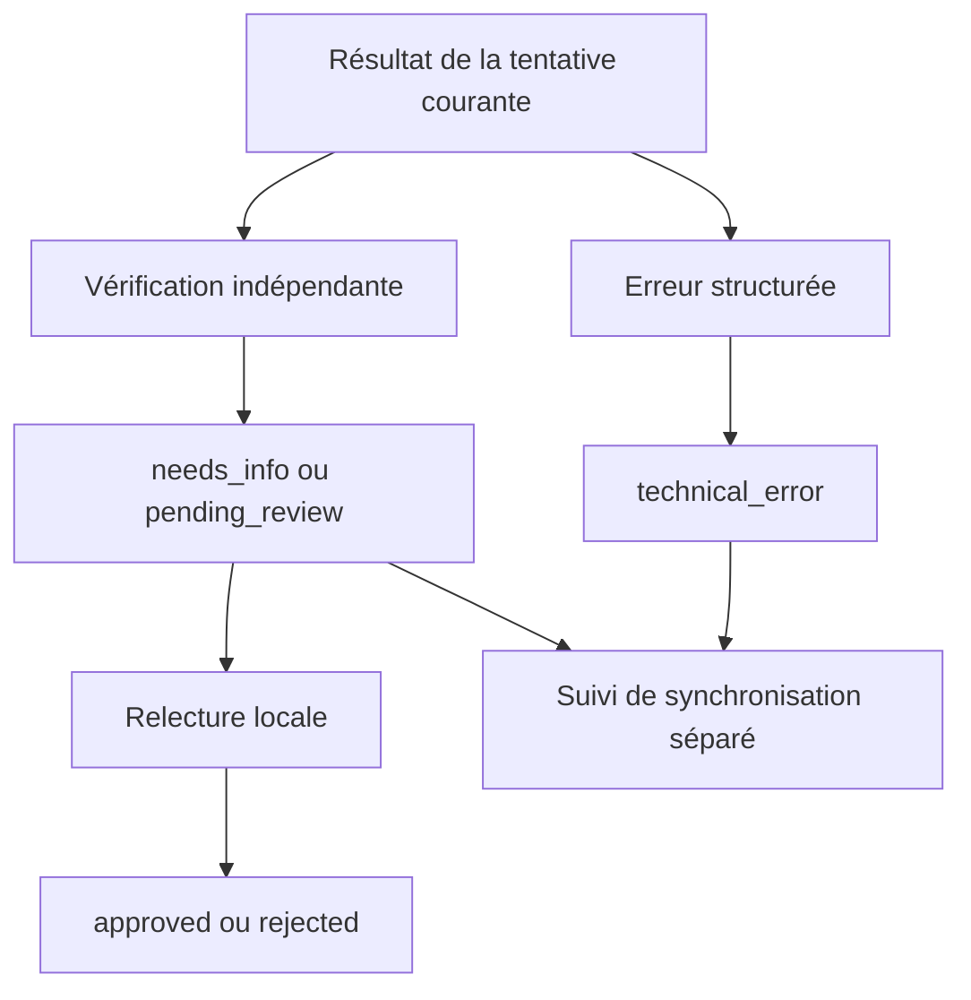

# 06 — Persistance du résultat, relecture et tests

Ce chapitre explique comment la démonstration **facts-v2** vérifie un résultat avant de le conserver, distingue la synchronisation de la qualification, et enregistre une décision de relecture. Il précise aussi ce que les tests couvrent et les limites réellement présentes dans le code.

Pour suivre ce chapitre seul, retenir le contrat initial : n8n réserve une demande dans SQLite et reçoit un identifiant accompagné d’un jeton de tentative. Le modèle extrait une catégorie et six faits depuis le message client. Le workflow applique des règles métier puis produit une analyse à quatre champs : `category`, `summary`, `missing_information` et `draft_reply`. Le serveur va maintenant vérifier cette analyse avant toute écriture. Le [chapitre précédent](https://github.com/nicolashedoire/n8n-docker/blob/main/docs/tutoriel/05-service-et-fournisseur.md) détaille la réservation et l’appel au fournisseur.

## Sources et nature des exemples

Sources du code relu le 3 octobre 2026 : [serveur et persistance](https://github.com/nicolashedoire/n8n-docker/blob/main/demo/server.mjs), [politique facts-v2](https://github.com/nicolashedoire/n8n-docker/blob/main/demo/qualification-policy.mjs), [tests du serveur](https://github.com/nicolashedoire/n8n-docker/blob/main/demo/test/server.test.mjs), [tests de l’adaptateur](https://github.com/nicolashedoire/n8n-docker/blob/main/demo/test/llm-provider.test.mjs) et [tests de la politique](https://github.com/nicolashedoire/n8n-docker/blob/main/demo/test/qualification-policy.test.mjs).

Les blocs JavaScript sont des extraits du code, parfois réindentés pour la lecture. Le diagramme Mermaid représente des transitions prévues par le code ; **il ne constitue pas une capture d’écran ni une preuve d’exécution réelle**. Ce chapitre ne contient aucune capture d’interface. La lecture des tests permet d’expliquer leur objectif ; une affirmation de réussite des tests nécessite un résultat d’exécution séparé et daté.



## 9. Enregistrer un résultat : vérifier à nouveau

`POST /requests/:id/result` exige le jeton de la tentative courante. Son corps contient soit `analysis`, soit `error`, jamais les deux. Une analyse réussie doit également fournir `extraction`, même si l’appelant omet toute métrique ou indique une autre version.

Le contrôle suit cet ordre :

1. Vérifier le jeton et l’existence de la demande.
2. Vérifier les quatre champs exacts d’`analysis`.
3. Valider les faits par rapport au message réellement conservé en base.
4. Recalculer la qualification et le brouillon avec la politique partagée.
5. Comparer l’analyse reçue et l’analyse attendue, après normalisation par le validateur.
6. Enregistrer le résultat et son événement dans la même transaction.

L’expression centrale est :

```js
const expected = validateAnalysis(
  composeAnalysis(applyQualificationRules(extraction))
);
if (JSON.stringify(analysis) !== JSON.stringify(expected)) {
  fail(422, 'analysis_mismatch',
    'Le résultat ne correspond pas aux faits et aux règles de qualification.');
}
```

Le service n’accepte donc pas une réponse arbitraire sous prétexte qu’elle arrive depuis n8n. Une modification accidentelle du brouillon dans un nœud, ou un appel direct à l’API avec une analyse incompatible, est refusé.

`validateExtraction` exige les six champs et vérifie que chaque extrait non vide apparaît dans le message source. Il tolère les différences de casse, d’espaces, les apostrophes courbes et la normalisation Unicode NFC. Il ne corrige pas les nombres, ne remplace pas des mots et ne supprime pas les accents. Par exemple, `4000 euros` ne devient pas automatiquement une preuve de `4 000 €`.

Cette preuve confirme une présence textuelle. Elle ne prouve pas qu’un montant a été affecté au bon champ, que le modèle a compris une négation ou qu’il a extrait toute l’information utile. La classification et le choix des extraits restent des tâches du modèle.

Le module partagé applique ensuite les champs requis par catégorie : besoin, budget et échéance pour un devis ; sujet et disponibilité pour un rendez-vous ; produit et problème pour du support ; objet précis pour les autres demandes. Une petite liste fermée d’expressions génériques empêche certaines formulations vagues de compter comme un besoin précis. Cette liste n’est pas un détecteur universel du flou.

Le brouillon est composé de phrases fixes du prestataire. Il ne reprend pas le texte client dans le corps de réponse. Le résumé, en revanche, cite les faits utiles. Cette séparation explique pourquoi une phrase hostile présente dans la source ne peut pas devenir directement une instruction ou un texte libre dans le brouillon.

Une analyse avec des informations manquantes devient `needs_info`. Sans information manquante, elle devient `pending_review`. Un objet d’erreur valide devient `technical_error`. Une répétition du même résultat finalisé est reconnue ; un remplacement par un autre résultat est refusé. Les anciennes lignes déjà conservées restent lisibles même si elles ne disposent pas de l’extraction désormais obligatoire pour les nouvelles écritures réussies.

## 10. État courant, historique et synchronisation

La fonction `record` construit l’objet présenté aux appelants. Elle récupère les événements, parse les champs JSON et expose le dernier objet d’extraction enregistré dans un événement `result_stored`. L’extraction est donc conservée dans l’historique, sans colonne supplémentaire dans la table principale.

Cette fonction ne renvoie pas le jeton de tentative, le bail ni l’empreinte. Le jeton apparaît uniquement dans la réponse de réservation autorisant un traitement. Cela évite de transformer la liste de consultation en distribution des droits d’écriture des tentatives.

Le résultat et sa synchronisation ont deux statuts distincts. `POST /requests/:id/sink` enregistre `synced`, `failed` ou `skipped`, avec le jeton de tentative. La synchronisation ne peut être enregistrée que lorsque le traitement a quitté `processing`.

Le service ne réalise pas l’écriture Google Sheets lui-même. Il conserve ce que le workflow déclare à propos de cette écriture. Une erreur de synchronisation peut donc laisser une analyse correcte et consultable dans SQLite. `skipped` permet d’expliquer qu’une destination n’était pas configurée.

Deux limites concrètes : cette route n’empêche pas un appel tardif `failed` de remplacer un précédent `synced` portant le même jeton ; aucune tâche de réparation automatique n’est définie dans le service. Un doublon d’une demande terminée ne déclenche pas, à lui seul, une nouvelle synchronisation.

Les événements constituent un historique applicatif lisible. Ils ne sont pas un journal inviolable : une personne disposant d’un accès direct au fichier SQLite peut le modifier.

## 11. Relecture humaine : ce qui est réellement protégé

`POST /requests/:id/approve` et `/reject` sont séparés de la route de résultat. Un champ d’analyse ou une instruction du modèle ne peut donc pas valider une demande. Ces routes n’acceptent que les états `pending_review` ou `needs_info` et enregistrent la décision dans un événement `human_decision`.

Le contrôle nommé `checkHuman` vérifie deux éléments : l’en-tête `Origin` correspond à l’origine attendue, et la requête présente une session locale avec le bon jeton CSRF. Le serveur crée cette session à l’ouverture de la page. Elle expire après huit heures et n’existe qu’en mémoire ; un redémarrage oblige à rouvrir la page.

Le cookie porte `HttpOnly` et `SameSite=Strict`. `HttpOnly` évite sa lecture directe par le JavaScript de la page ; `SameSite=Strict` limite son envoi dans un contexte provenant d’un autre site. Le jeton CSRF relie la requête à la session chargée depuis le service.

Ces contrôles protègent le parcours web local contre certaines requêtes venant d’une autre origine. Ils ne constituent pas une authentification nominative ni une preuve qu’un humain est physiquement présent. Les consultations et l’API machine ne disposent pas d’un système de comptes. La portée de cette démonstration est un service local ; une exposition à d’autres utilisateurs demanderait un autre modèle d’accès.

L’événement de décision indique `actor: local_reviewer` et `delivery: none`. Approuver une demande marque la relecture du brouillon, y compris lorsqu’il demande des précisions. Cela n’envoie aucun email et ne réserve aucun rendez-vous. Une erreur technique ne peut pas être approuvée par cette route.

## 12. Les autres routes et les limites utiles à expliquer

| Route | Utilité et limite |
| --- | --- |
| `GET /health` | Indique que le service répond et décrit sa configuration. Ne teste pas l’accès au modèle, les crédits ni la validité distante de la clé. |
| `GET /requests` | Retourne les 100 demandes les plus récentes avec leur historique. Pas de pagination. |
| `GET /requests/:id` | Retourne une demande précise ou une erreur 404. |
| `POST /submit` | Relaye une demande vers le webhook n8n après contrôle de session et normalisation. |

Le relais `/submit` peut attendre jusqu’à 390 secondes. Si la connexion vers n8n échoue, il prévient qu’une exécution peut néanmoins continuer. Un client qui ne reçoit pas de réponse ne peut pas conclure que le travail n’a jamais commencé : c’est une autre raison de conserver un identifiant stable.

Un point à améliorer dans l’implémentation actuelle : si n8n répond HTTP 200 avec un corps qui n’est pas du JSON, `/submit` renvoie encore HTTP 200 et le message « Réponse n8n sans JSON ». Le service exprime alors insuffisamment que le résultat final est inconnu. Cette situation ne doit pas être présentée comme une réussite métier vérifiée.

Les choix de SQLite synchrone, de sessions en mémoire et d’un service HTTP minimal rendent le code accessible pour la démonstration. Ils impliquent aussi des limites explicites : les opérations de base bloquent brièvement le processus Node, il n’y a pas de politique de rétention, pas de nettoyage automatique des demandes abandonnées et pas de sauvegarde pilotée par ce code. Les événements n’ont pas d’index spécifique sur `request_id` ; une accumulation importante pourrait rendre leur lecture plus coûteuse.

Le code demande de copier une phrase complète pour le besoin tout en limitant chaque extrait à 300 caractères. Une phrase source particulièrement longue exige donc un choix du modèle sous cette contrainte. Le schéma garantit la taille, pas la conservation de toutes les nuances d’une longue phrase.

## 13. Ce que les tests cherchent à démontrer

Les trois fichiers de tests présents totalisent 29 tests déclarés. Cette rédaction les a relus sans relancer les tests ni effectuer d’appel fournisseur. Le résultat d’une exécution de tests doit être présenté séparément, avec son contexte.

| Fichier | Garanties visées |
| --- | --- |
| `demo/test/server.test.mjs` | Réservations concurrentes, contenu conflictuel, reprise de bail, rejet d’ancien jeton, vérification indépendante, décisions protégées, conservation après erreur ou réouverture de SQLite. |
| `demo/test/llm-provider.test.mjs` | Construction de l’appel Responses, refus, réponses incomplètes, erreurs 401/429, choix de clé, absence de fuite dans les métadonnées, délai borné. |
| `demo/test/qualification-policy.test.mjs` | Cas complets ou incomplets, catégories distinctes, extraits attestés, champs interdits, résistance du brouillon aux instructions du message, comportement identique après sérialisation pour n8n. |

L’injection de `fetchImpl`, de l’horloge et du chemin de base permet de provoquer ces situations de façon contrôlée. Les tests HTTP du fournisseur utilisent des réponses simulées : ils vérifient l’adaptateur sans consommer de crédit et sans dépendre d’Internet. Ils ne prouvent pas que le modèle configuré comprend toutes les demandes réelles.

La qualité sémantique demande un corpus de cas réels ou fictifs représentatifs : demandes complètes, vagues, rendez-vous, support, négations et ambiguïtés. Le fait qu’un JSON respecte un schéma ne remplace pas cette évaluation.

## 14. Une explication orale courte pour l’entretien

« n8n orchestre le traitement. Le service réserve chaque demande dans SQLite pour reconnaître les répétitions et conserver son état. Le modèle extrait des faits dans un schéma fermé. Les règles métier déterminent les informations manquantes et composent le brouillon. Avant de stocker le résultat, le service vérifie les extraits dans le message d’origine et recalcule la même analyse. La synchronisation a son propre statut, pour conserver une analyse même si une destination échoue. Une décision de relecture est enregistrée séparément et aucun email n’est envoyé automatiquement. »

Pour approfondir, expliquer une garantie avec son mécanisme : doublon → identifiant et transaction ; reprise → bail et nouveau jeton ; réponse incohérente → recalcul indépendant ; panne externe → erreur conservée ; approbation → route séparée et session locale. Puis donner sa limite exacte, sans promettre une fiabilité que le code ne vérifie pas.
