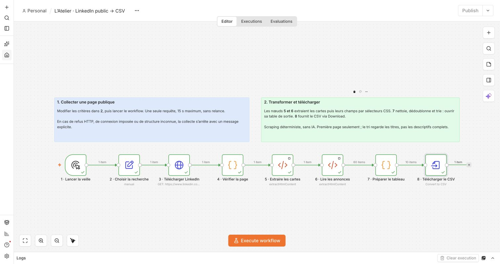
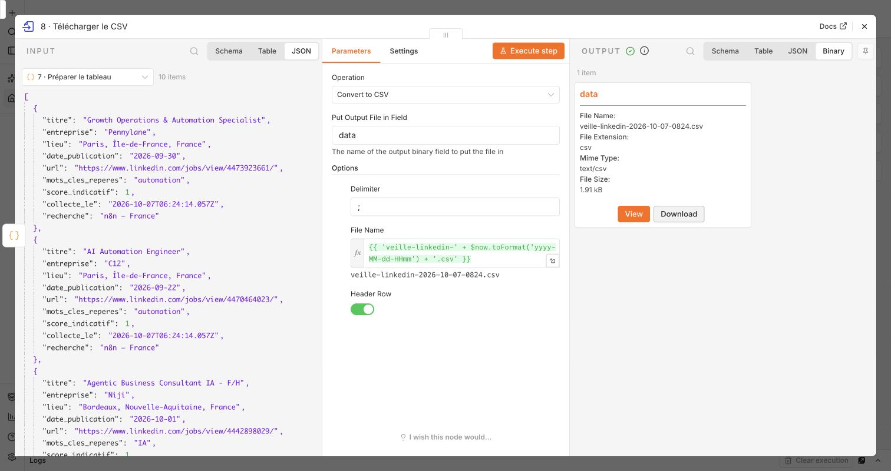

# Atelier n8n · Veille LinkedIn publique vers CSV

**Scénario :** « Je veux consulter les annonces qui parlent de n8n en France, puis ouvrir une sélection dans mon tableur. »
Le workflow télécharge une page publique, extrait les cartes d’annonces et prépare un CSV : aucune clé API, aucun compte LinkedIn connecté, aucun appel à un modèle IA.
Il s’agit de scraping HTML déterministe, et non d’un agent IA : les étapes et les règles de tri sont définies à l’avance.

[Ouvrir le workflow local dans n8n](http://localhost:5678/workflow/atelierLinkedinVeille01) · [Fichier à importer](workflows/linkedin-veille.json)

[Guide illustré dans Notion — page privée](https://app.notion.com/p/3f2ce9b72fb781bda7faf79ed11bb437)



**Vérifié le 7 octobre 2026 à 08 h 24 (Paris)** : exécution n8n 94 réussie en 2,027 s, 60 cartes extraites de la page reçue et 10 annonces distinctes dans le CSV téléchargé (1 914 octets). Les 13 tests automatisés passent. Ce constat décrit cet essai ; la disponibilité et les résultats de LinkedIn peuvent changer.

## Faire la démonstration

1. Ouvrir **2 · Choisir la recherche** et conserver `keywords = n8n`, `location = France`, `max_results = 10` pour une première tentative.
2. Revenir au canvas et cliquer sur **Execute workflow**. Le déclenchement est manuel ; aucune planification ne tourne en arrière-plan.
3. Ouvrir **7 · Préparer le tableau**, puis **Output → Table** : une ligne correspond à une annonce conservée.
4. Ouvrir **8 · Télécharger le CSV**, puis la sortie binaire `data` et **Download**.
5. Ouvrir le fichier `veille-linkedin-AAAA-MM-JJ-HHmm.csv` dans un tableur ; sélectionner le séparateur `;` si nécessaire.



Un refus du site reste possible à chaque exécution. En cas de nœud rouge, consulter son message ; ne pas présenter une ancienne sortie comme une collecte actuelle.

## Les huit nœuds, dans l’ordre

### 1 · Lancer la veille — Manual Trigger

Le bouton d’exécution démarre le workflow. Ce nœud permet de montrer chaque étape à la demande, sans créer d’automatisation récurrente.

### 2 · Choisir la recherche — Edit Fields / Set

| Champ | Exemple | Rôle |
| --- | --- | --- |
| `keywords` | `n8n` | Terme envoyé à la recherche LinkedIn. |
| `location` | `France` | Localisation envoyée à LinkedIn. |
| `max_results` | `10` | Plafond de lignes exportées après nettoyage et classement. |
| `priority_terms` | `n8n, automatisation, automation, IA` | Mots ou expressions recherchés dans les titres pour le tri local. |

`max_results` ne détermine ni le nombre de pages téléchargées ni le nombre exact d’annonces retournées par LinkedIn.
Le code borne ce plafond entre 1 et 25 ; une valeur non numérique utilise 10.

### 3 · Télécharger LinkedIn — HTTP Request

Le nœud réalise un `GET https://www.linkedin.com/jobs/search/`, avec `keywords` et `location` dans les paramètres de l’URL.
Il demande du HTML avec `Accept: text/html` et conserve le corps, les en-têtes et le code HTTP de la réponse.
Il ne suit pas les redirections et ne relance pas automatiquement une requête en erreur.
Le délai HTTP configuré est de 15 000 ms ; une panne réseau ou un dépassement de délai arrête ce nœud.
L’option **Never Error** laisse passer les réponses HTTP non réussies vers le contrôle explicite du nœud 4 ; elle ne transforme pas un refus en résultat exploitable.

### 4 · Vérifier la page — Code

`verifyPage(response)` contrôle le code HTTP, la présence d’un corps HTML et les marqueurs de la liste et des cartes d’annonces.
La fonction renvoie `{ html, collected_at, http_status }` uniquement si ces contrôles passent.
`collected_at` indique quand notre workflow a reçu et vérifié la page ; ce n’est pas la date de publication des offres.
Cette vérification empêche de produire un CSV vide en affirmant que la collecte a réussi alors qu’une page de connexion a été reçue.
Elle ne prétend pas distinguer parfaitement une recherche vide d’une modification du site : le message invite alors à contrôler la réponse.

### 5 · Extraire les cartes — HTML

Ce nœud lit le champ `html` et sélectionne `.jobs-search__results-list .base-search-card`.
Avec **Return Value = HTML** et **Return Array = true**, il renvoie `cards`, un tableau de fragments HTML, un fragment par carte.

### 6 · Lire les annonces — HTML

Le nœud HTML accepte directement le tableau `cards` et extrait les champs de chaque fragment séparément.
La version 1.1 de ce nœud est conservée pour sa lecture du texte brut : elle n’ajoute pas l’adresse des liens au nom des entreprises, contrairement à la conversion HTML-vers-texte de la version 1.2.

| Champ de sortie | Sélecteur CSS | Valeur lue |
| --- | --- | --- |
| `title` | `.base-search-card__title` | Texte du titre. |
| `company` | `.base-search-card__subtitle` | Texte de l’entreprise. |
| `location` | `.job-search-card__location` | Texte du lieu. |
| `url` | `a.base-card__full-link` | Attribut `href`. |
| `published_at` | `time[datetime]` | Attribut `datetime`. |

**Pourquoi deux nœuds HTML ?** Pour conserver ensemble les champs de chaque annonce. Extraire séparément tous les titres et tous les lieux de la page pourrait décaler les correspondances lorsqu’une carte n’a pas de lieu.
Les sélecteurs sont des repères dans le HTML actuel du site ; ils peuvent nécessiter une mise à jour si LinkedIn modifie ses cartes.

### 7 · Préparer le tableau — Code

`prepareJobs(rows, config, collectedAt)` reçoit les annonces extraites, les critères du nœud 2 et l’horodatage du nœud 4.
Le nœud utilise `$input.all()` pour lire les annonces et les références aux nœuds précédents pour retrouver les critères et l’heure de collecte.
La fonction est autonome : elle n’importe aucun paquet et est insérée directement dans le nœud Code lors de la génération du workflow.

| Fonction interne | Pourquoi elle existe |
| --- | --- |
| `clean()` | Réduire les espaces, supprimer certains caractères de contrôle et conserver du texte propre. |
| `canonicalJob()` | Accepter uniquement les liens HTTPS de fiches d’emploi LinkedIn, extraire l’identifiant et retirer le suivi de l’URL. |
| `tokens()` | Comparer les mots sans distinguer majuscules et accents, avec des limites de mots. |
| `publicationDate()` | Conserver une date ISO valide ; laisser vide une date absente ou inexploitable, sans l’inventer. |
| `spreadsheetText()` | Préfixer les textes commençant par `=`, `+`, `-` ou `@` pour éviter leur interprétation comme formule dans un tableur. |

Un ensemble `Set` mémorise les identifiants déjà rencontrés et supprime les doublons **dans cette exécution**.
Une annonce sans titre ou sans URL LinkedIn valide est ignorée ; entreprise, lieu et date peuvent rester vides.
Le `score_indicatif` compte les termes prioritaires distincts présents dans le **titre uniquement**. Exemple : « Développeur n8n et IA » vaut 2 avec la configuration initiale.
Le code trie les scores décroissants, conserve l’ordre source en cas d’égalité, puis applique le plafond d’export.
Ce score ne mesure ni l’adéquation à ton profil, ni la qualité de l’annonce, ni la présence des compétences dans sa description complète.

### 8 · Télécharger le CSV — Convert to File

Le nœud transforme les lignes JSON en un fichier binaire dans `data`, avec une ligne d’en-tête et le séparateur `;`.
Colonnes : `titre`, `entreprise`, `lieu`, `date_publication`, `url`, `mots_cles_reperes`, `score_indicatif`, `collecte_le`, `recherche`.
Le fichier est disponible dans la sortie n8n ; aucune donnée n’est envoyée par e-mail ou ajoutée à un CRM.

## Comprendre un arrêt

| Incident | Comportement prévu |
| --- | --- |
| Délai dépassé ou réseau indisponible | Le nœud HTTP s’arrête ; consulter l’erreur de cette exécution. |
| HTTP `429` | La vérification signale une limitation ; pas de relance automatique. |
| HTTP `401`, `403` ou `999` | Accès public refusé ; arrêt explicite. |
| Redirection HTTP `3xx` | Arrêt pour vérifier manuellement la source. |
| Réponse inattendue ou cartes absentes | Arrêt : recherche vide, connexion imposée ou structure modifiée à vérifier. |
| Aucune ligne avec titre et lien valides | `NO_USABLE_JOBS` : contrôler la page et les sélecteurs. |

Le workflow télécharge **une seule page**, sans pagination, sans visite des profils et sans téléchargement des descriptions complètes.
Il ne garantit donc pas l’exhaustivité des offres, ni la disponibilité permanente de la collecte publique.

## Construire, tester et importer

Depuis la racine du dépôt :

```sh
node linkedin/build-workflow.mjs
node --test linkedin/test/*.test.mjs
```

Le premier programme génère `linkedin/workflows/linkedin-veille.json`. Les tests vérifient les contrôles de page et le traitement des annonces ; ils ne prouvent pas que LinkedIn sera accessible lors d’une prochaine exécution.
Pour importer : créer un workflow dans n8n, ouvrir le menu `…`, choisir **Import from File**, sélectionner ce JSON et enregistrer.
L’URL locale indiquée en haut correspond à l’installation de l’atelier ; un import manuel peut recevoir un autre identifiant dans n8n.

## Le présenter en trente secondes

> « Je pars d’une recherche n8n en France. Je télécharge une page publique, je contrôle sa réponse, puis j’extrais chaque annonce avec des sélecteurs HTML. Mon code nettoie les données, retire les doublons et classe les titres selon des mots choisis. Le résultat devient un CSV consultable. Il n’y a pas besoin d’IA pour cette extraction structurée ; je peux montrer précisément d’où vient chaque colonne. »

## Documentation officielle

- [n8n · HTTP Request : paramètres, réponse, redirections et délai](https://docs.n8n.io/integrations/builtin/core-nodes/n8n-nodes-base.httprequest)
- [n8n · HTML : extraction par sélecteurs CSS, attributs et tableaux](https://docs.n8n.io/integrations/builtin/core-nodes/n8n-nodes-base.html)
- [n8n · Convert to File : génération d’un CSV](https://docs.n8n.io/integrations/builtin/core-nodes/n8n-nodes-base.converttofile)
